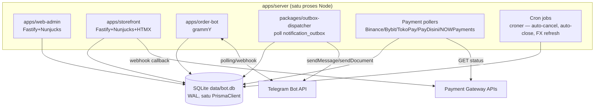
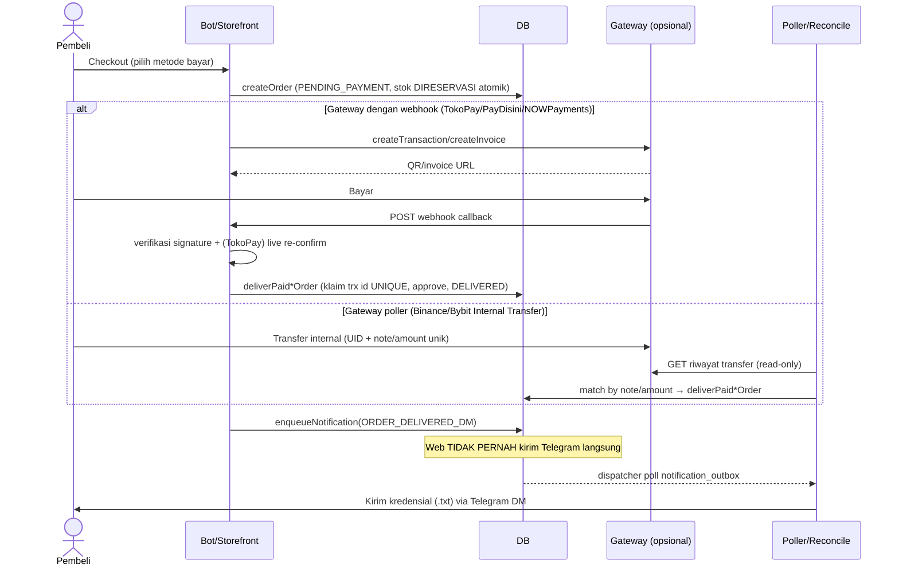

# Arsitektur

> Ringkasan padat ada di [`../DOCS.md` §1](../DOCS.md#1-arsitektur). Dokumen
> ini menambahkan diagram + detail komponen yang tidak dijelaskan di sana.

## Apa yang TIDAK ada di stack ini

Sebelum membaca lebih lanjut — daftar ini sengaja ditulis duluan karena
istilah-istilah generik sering diasumsikan ada padahal tidak:

- **Tidak ada Redis** atau cache layer eksternal apa pun.
- **Tidak ada job-queue terpisah** (Bull/BullMQ/Sidekiq-style) — antrian
  notifikasi adalah satu tabel SQLite yang di-poll in-process, lihat
  [QUEUE_SYSTEM.md](QUEUE_SYSTEM.md).
- **Tidak ada WebSocket.** Update status pembayaran live di storefront
  memakai **HTMX polling** (`GET /checkout/:code/status` setiap ~5 detik),
  bukan koneksi persisten.
- **Tidak ada server database terpisah** — SQLite satu file, mode WAL.
- **Tidak ada API publik (REST/GraphQL)** untuk pihak ketiga — server-rendered
  HTML penuh, lihat [API_REFERENCE.md](API_REFERENCE.md).

## Frontend

Tiga permukaan, satu bahasa visual ("Clean Modern", tema bersama
`packages/web-ui/_theme.njk`):

| Permukaan | Teknologi | Rendering |
|---|---|---|
| Bot Telegram (`apps/order-bot`) | grammY 1.30 + `@grammyjs/conversations` (wizard) + `@grammyjs/runner` | Pesan/keyboard inline Telegram |
| Panel admin (`apps/web-admin`) | Fastify 5 + Nunjucks 3 + HTMX | Server-rendered HTML |
| Toko web (`apps/storefront`) | Fastify 5 + Nunjucks 3 + HTMX | Server-rendered HTML |

Tidak ada SPA, tidak ada bundle JS framework (React/Vue) — HTMX menangani
interaksi dinamis (submit form tanpa reload penuh, polling status) di atas
HTML yang di-render server.

## Backend

`apps/server/src/index.ts` adalah **composition root** — satu proses Node
yang:
1. `initDb()` — buka koneksi SQLite, aktifkan WAL + `busy_timeout`.
2. Resolve token bot/admin ids/cookie secret (DB menang atas `.env` — lihat
   [CONFIGURATION.md](CONFIGURATION.md)).
3. Boot instance Fastify untuk admin + storefront.
4. Inisialisasi bot grammY (`polling` atau `webhook` sesuai `BOT_MODE`).
5. Jalankan worker in-process (lihat bagian Workers di bawah).
6. Listen satu port (jika `SHOP_PUBLIC_URL` diset, dispatch by `Host` header)
   atau dua port terpisah (admin `WEB_PORT`, storefront `STOREFRONT_PORT`).



## Workers (in-process, bukan proses OS terpisah)

| Worker | Jalan di | Interval | Fungsi |
|---|---|---|---|
| Outbox dispatcher | `packages/outbox-dispatcher` | `NOTIF_POLL_INTERVAL_SECONDS` (default 10s) | Drain `notification_outbox` → Telegram |
| Binance poller | `apps/order-bot/src/payments/binanceInternal.ts` | `POLL_INTERVAL_SECONDS` (default 10s) | Cocokkan transfer masuk by-note/by-amount |
| Bybit poller | `.../bybitDeposit.ts` | `BYBIT_POLL_INTERVAL_SECONDS` (default 5s) | Cocokkan deposit by unique-amount |
| TokoPay/PayDisini/NOWPayments reconcile | `.../{tokopay,paydisini,nowpayments}Reconcile.ts` | `POLL_INTERVAL_SECONDS` | Fallback jika webhook tidak sampai |
| Cron jobs | `apps/order-bot/src/jobs/index.ts` (croner) | Lihat tabel di bawah | Auto-cancel, auto-close, broadcast, watchdog, FX refresh |

```text
*/1 * * * *   autoCancelExpiredOrders   { protect: true }
0 * * * *     autoCloseStaleTickets     { protect: true }
0 */6 * * *   reconcileFinancesJob
*/2 * * * *   binancePollWatchdog
*/2 * * * *   bybitPollWatchdog
*/1 * * * *   drainBroadcasts           { protect: true }
5 * * * *     scheduleFxRefresh (terpisah — jalan walau bot OFF)
```

`{ protect: true }` (croner) mencegah tick yang sama overlap dengan dirinya
sendiri (mis. tick lambat bertemu tick berikutnya) — mencegah double-send.

## Database

Satu file SQLite, mode WAL, satu `PrismaClient` singleton dibagi semua
komponen di atas. Detail model/relasi: [DATABASE.md](DATABASE.md).

## Sistem antrian (bukan queue eksternal)

`notification_outbox` adalah tabel SQLite yang berfungsi sebagai antrian
job — diisi (`enqueueNotification`) oleh request handler mana pun yang perlu
mengirim Telegram, dikonsumsi oleh dispatcher poll. Detail klaim
atomik/backoff/stale-reaper: [QUEUE_SYSTEM.md](QUEUE_SYSTEM.md).

## Alur pembayaran



Detail per gateway (signature scheme, idempotency ledger, reconcile poller):
[PAYMENT_GATEWAY.md](PAYMENT_GATEWAY.md).

## Alur order & state machine

Lihat [ORDER_STATE_MACHINE.md](ORDER_STATE_MACHINE.md) untuk diagram status
lengkap. Ringkas: `PENDING_PAYMENT` → (opsional `PENDING_VERIFICATION`,
transien untuk SEMUA jalur termasuk auto-confirm) → `DELIVERED`, atau
`CANCELLED`/`REJECTED`/`REFUNDED`/`UNDERPAID` sebagai cabang.

## Sistem inventori

Stok direservasi **atomik saat checkout** (bukan saat approve) — lihat
[INVENTORY_SYSTEM.md](INVENTORY_SYSTEM.md) untuk detail
`allocateOneAvailableStock` dan kebijakan dedup `bulkAddStock`.

## "Websocket events" — yang ada sebagai gantinya

Tidak ada socket persisten. Dua mekanisme live-update:

1. **HTMX polling** — `GET /checkout/:code/status` di-poll browser pembeli
   tiap ~5 detik selama halaman bayar terbuka.
2. **Bubble edit Telegram** — bot meng-edit pesan yang sama (`editMessageCaption`/
   `editMessageText`) saat status order berubah (poller/reconcile/webhook),
   bukan mengirim pesan baru — lihat konvensi "Edit the bubble, don't just
   toast" di [`../CLAUDE.md`](../CLAUDE.md).

## Catatan desain yang diketahui (bukan bug, tapi batasan sadar)

- **Sesi bot in-memory** — restart proses mereset conversation/menu state
  pengguna aktif ke menu utama. Lihat catatan di
  [UPDATE_GUIDE.md](UPDATE_GUIDE.md) "Cache & Redis".
- **Rate-limit in-memory** — reset saat restart, tidak terbagi antar proses
  (tapi hanya ada satu proses, jadi ini bukan masalah horizontal-scaling
  hari ini).
- **Single-writer SQLite** — `apps/server` SATU proses adalah jaminan
  keamanan-nya; jangan jalankan dua instance menulis ke `bot.db` yang sama.
  Trigger migrasi ke Postgres: ≥2 *concurrent writer* yang sungguhan
  dibutuhkan (lihat catatan lintas-domain di
  `docs/audit-security-2026-06-23.md`).
