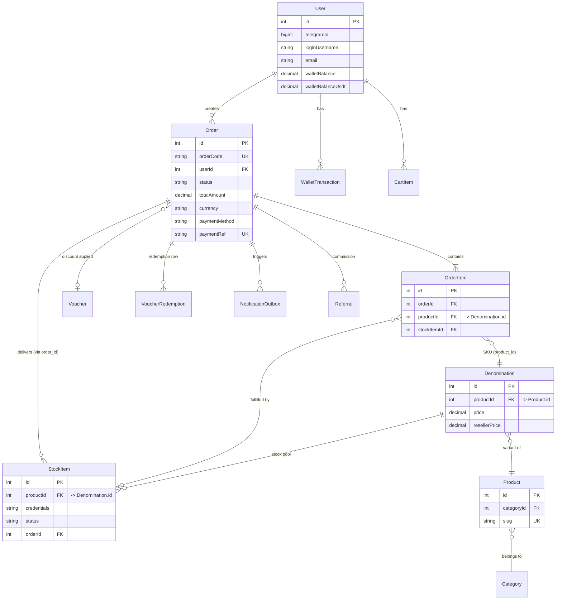

# Database

Satu skema Prisma (`prisma/schema.prisma`), satu file SQLite (`data/bot.db`,
mode **WAL**), dipakai bersama oleh `apps/order-bot`, `apps/web-admin`,
`apps/storefront`, dan `apps/server`. **26 model.** Tidak ada server database
terpisah, tidak ada Postgres/MySQL/Redis di stack ini saat ini (trigger resmi
untuk migrasi ke Postgres: ≥2 *concurrent writer* — lihat catatan di
`docs/audit-security-2026-06-23.md` bagian "Ketergantungan implisit pada
`BEGIN IMMEDIATE` SQLite").

> ⚠️ **Jangan ubah nama kolom/tabel** tanpa migrasi — setiap `@map`/`@@map`
> mempertahankan nama kolom apa adanya dari skema lama (lihat komentar header
> `schema.prisma`). Beberapa relasi Prisma bernama `product` sebenarnya
> me-resolve ke model `Denomination` (bukan `Product`) — sisa rename historis
> (Category→Product→Denomination); jangan tertipu nama field.

## Triggers

**Tidak ada trigger SQL di level database.** Semua invariant (reservasi
stok, klaim atomik, idempotensi pembayaran) ditegakkan di lapisan aplikasi
(`packages/db/src/crud/*`) lewat `updateMany` kondisional dan
`$transaction` Prisma — lihat [ORDER_STATE_MACHINE.md](ORDER_STATE_MACHINE.md)
dan [QUEUE_SYSTEM.md](QUEUE_SYSTEM.md).

## ERD — inti Order/Stok/Pembayaran



## Model per domain

### Identitas & sesi

| Model | Tabel | Catatan kunci |
|---|---|---|
| `User` | `users` | `telegramId` & `email`/`loginUsername`/`passwordHash` **nullable** (akun web-only vs Telegram-only). Dua saldo terpisah: `walletBalance` (IDR), `walletBalanceUsdt` — tanpa konversi otomatis. `referralCode` unik per user. |
| `WalletTransaction` | `wallet_transactions` | Ledger **append-only**. `onDelete: Restrict` ke `User` (Infra-5 fix audit 2026-06-23) — User tidak boleh dihapus selama punya histori wallet. |
| `PasswordResetToken` | `password_reset_tokens` | Hanya SHA-256 hex token disimpan, single-use (`usedAt`), TTL 1 jam. |

### Katalog (3 tier)

| Model | Tabel | Catatan kunci |
|---|---|---|
| `Category` | `categories` | Tier 1. `slug` unik. |
| `Product` | `products` | Tier 2 — **tanpa harga/stok sendiri**. Tabel fisik bernama `products` tapi secara konseptual ini cuma kartu navigasi (nama lama: `product_groups`). |
| `Denomination` | `denominations` | Tier 3 — SKU sungguhan. Punya `price`, `costPrice`, `resellerPrice`, `warrantyDays`. Tabel fisik bernama `denominations` (dulu `products`) — semua FK `product_id` di tabel lain (stock_items, order_items, cart_items, bulk_pricing, reviews, restock_subscriptions) menunjuk ke SINI, bukan ke `products`. |

### Order & Stok

| Model | Tabel | Catatan kunci |
|---|---|---|
| `Order` | `orders` | `status` (lihat [ORDER_STATE_MACHINE.md](ORDER_STATE_MACHINE.md)), snapshot `currency`/`fxRate` saat bayar, `uniqueCents` (disambiguator Bybit/Binance amount-match). Index gabungan `(status, createdAt)` untuk query antrian. |
| `OrderItem` | `order_items` | `onDelete: Restrict` ke `Order` (baris finansial tidak boleh hilang diam-diam). |
| `StockItem` | `stock_items` | `status`: `AVAILABLE`/`RESERVED`/`SOLD`/`DEAD`. Index `(productId, status)` untuk alokasi cepat. Lihat [INVENTORY_SYSTEM.md](INVENTORY_SYSTEM.md). |
| `BulkPricing` | `bulk_pricing` | Satu baris per Denomination (`@unique`), diskon tier kuantitas. |
| `RestockSubscription` | `restock_subscriptions` | Unique `(userId, productId)` — satu subscription per user per SKU. |
| `CartItem` | `cart_items` | Unique `(userId, productId)` — qty digabung, bukan baris baru. |

### Pricing & Voucher

| Model | Tabel | Catatan kunci |
|---|---|---|
| `Voucher` | `vouchers` | `usageLimit`/`usedCount` global; cap per-user via `VoucherRedemption`. |
| `VoucherRedemption` | `voucher_redemptions` | Unique `(voucherId, userId)` — gate atomik 1x/voucher/user (Pricing-1 fix, audit 2026-06-23). |

### Review, Referral, Support

| Model | Tabel | Catatan kunci |
|---|---|---|
| `Review` | `reviews` | Unique `(userId, orderId)`. `onDelete: Restrict` ke `Order` (provenance verified-purchase). |
| `Referral` | `referrals` | `refereeId` unik (satu referee, satu referrer). `onDelete: Restrict` ke `Order` (ledger komisi). |
| `SupportTicket` / `TicketMessage` | `support_tickets` / `ticket_messages` | Thread sederhana; `senderType` USER/ADMIN. |

### Notifikasi, Broadcast, Audit

| Model | Tabel | Catatan kunci |
|---|---|---|
| `NotificationOutbox` | `notification_outbox` | Antrian — lihat [QUEUE_SYSTEM.md](QUEUE_SYSTEM.md) untuk `claimedAt`/`nextRetryAt`. |
| `Broadcast` | `broadcasts` | Diisi web, dikonsumsi bot (`drainBroadcasts`) — web tidak pernah kirim Telegram langsung. |
| `AuditLog` | `audit_logs` | `adminId` nullable (`null` = aksi sistem/auto). Index `createdAt`. |
| `Setting` | `settings` | Key-value generik — kredensial, flag, JTI sesi, semua bercampur di satu tabel (lihat catatan desain di [SECURITY.md](SECURITY.md)). |

### Idempotency ledger pembayaran

5 tabel identik secara struktur, satu per gateway — `UNIQUE` pada id
transaksi gateway adalah satu-satunya kunci anti-double-delivery (SQLite
tidak punya row lock; insert-first-on-unique adalah gerbang konkurensi):

| Model | Tabel | Kolom unik | outcome yang mungkin |
|---|---|---|---|
| `ProcessedBinanceTx` | `processed_binance_tx` | `binanceTxId` | matched / underpaid / unmatched |
| `ProcessedBybitTx` | `processed_bybit_tx` | `bybitTxId` | matched / unmatched / delivery_failed |
| `ProcessedTokopayTx` | `processed_tokopay_tx` | `trxId` | matched / unmatched / delivery_failed |
| `ProcessedPaydisiniTx` | `processed_paydisini_tx` | `trxId` | matched / unmatched / delivery_failed / stale |
| `ProcessedNowpaymentsTx` | `processed_nowpayments_tx` | `trxId` | matched / unmatched / delivery_failed / stale |

Detail per gateway di [PAYMENT_GATEWAY.md](PAYMENT_GATEWAY.md).

## Foreign key & cascade policy

Default Prisma kalau tidak disebut adalah `Cascade`. Repo ini **sengaja
membedakan** dua kelas relasi (Infra-5 fix, audit keamanan 2026-06-23):

- **`Restrict`** — relasi finansial/audit yang TIDAK BOLEH hilang diam-diam
  saat parent dihapus: `WalletTransaction.user`, `OrderItem.order`,
  `Review.order`, `Referral.order`. Tidak ada jalur produksi yang hard-delete
  `User`/`Order` hari ini — ini guardrail skema untuk masa depan, bukan
  perubahan behavior.
- **`Cascade`** — relasi non-finansial yang aman dibersihkan otomatis:
  `CartItem`, `PasswordResetToken`, `SupportTicket`/`TicketMessage`,
  `RestockSubscription`, `VoucherRedemption`, `Referral.referee/referrer`
  (User sisi lain), `StockItem.product` (Denomination dihapus → stok ikut).

## Index signifikan

- `orders`: `(status)`, `(status, createdAt)`, `(binanceTxid)`, `(bybitTxid)`
  — semua untuk query antrian poller/reconcile.
- `stock_items`: `(status)`, `(productId)`, `(productId, status)` — alokasi
  stok per-SKU adalah hot path checkout.
- `notification_outbox`: `(status, createdAt)`, `(status)`, `(createdAt)`,
  `(orderId)` — dispatcher poll tiap `NOTIF_POLL_INTERVAL_SECONDS`.
- Setiap tabel `processed_*_tx`: index pada `orderId` (lookup balik dari
  order ke baris ledger-nya, dipakai panel admin /payments).

## Generate ERD penuh

Untuk diagram 26-model lengkap (semua FK, bukan ringkasan domain di atas):

```bash
pnpm exec prisma generate    # pastikan client up-to-date dulu
npx prisma-erd-generator     # atau tool ERD pilihan Anda, baca langsung dari schema.prisma
```

Repo ini tidak meng-commit generator ERD sebagai dependency — schema.prisma
sendiri (614 baris, dikomentari padat) adalah sumber kebenaran paling akurat;
ringkasan di atas dipertahankan manual setiap kali model berubah.
