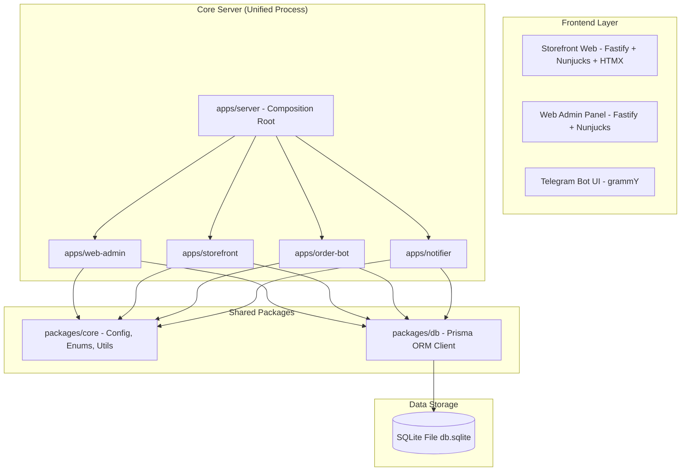
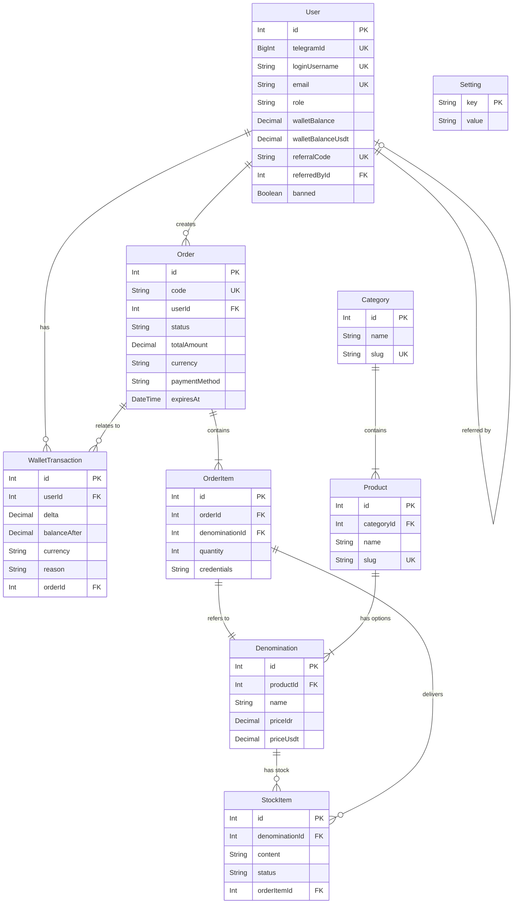
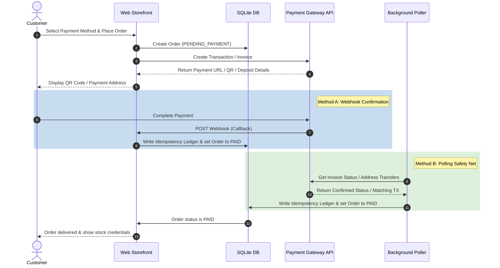

# Comprehensive Project Architecture Report

This document outlines the architecture, data flows, components, and constraints of the **BOT dan Web Admin** platform. The system is designed to sell digital goods (licenses, accounts, files) via a Telegram Bot interface and a customer-facing Web Storefront, managed by an unified Web Admin Panel.

---

## 1. Tech Stack & Core Dependencies

The platform is structured as a TypeScript monorepo using `pnpm` workspaces, running on **Node.js (>=20)** and built with modern, lightweight libraries.



### Core Technologies
*   **Runtime & Language:** Node.js (ESM) + TypeScript 5.
*   **Package Manager:** pnpm 9.15.9 (configured via [pnpm-workspace.yaml](file:///c:/Users/manda/OneDrive/Dokumen/PROJECT%20BOT%20ORDER/BOT%20dan%20Web%20Admin/pnpm-workspace.yaml)).
*   **Database ORM:** Prisma 5.22, targeting SQLite in WAL (Write-Ahead Logging) mode.
*   **Web Framework:** Fastify 5 (routing, hooks, cookie session management, templates).
*   **Telegram Bot Framework:** grammY 1.30 + `@grammyjs/conversations` (wizard states) + `@grammyjs/runner` (concurrency controls).
*   **HTML Templating Engine:** Nunjucks 3 (compiled server-side; shared components via Nunjucks macros).
*   **Client Interactions:** HTMX (for dynamic, single-page-like updates on the storefront without heavy JS).
*   **Validation:** Zod (strict validation for incoming configurations and schemas).
*   **Encryption & Hashing:** `bcryptjs` (password storage), `node:crypto` (HMAC signatures for session cookies, Telegram Widget signatures, and TOTP 2FA).
*   **Precision Math:** `decimal.js` (essential to prevent float precision issues with transaction balances and micro-payment currency calculations).
*   **Cron Scheduler:** `croner` (timezone-aware task scheduler).
*   **Logger:** `pino` (low-overhead JSON logger).
*   **Build Bundler:** `esbuild` (configured in custom bundler script).

---

## 2. Monorepo Folder Structure

The repository organizes code into modular applications (`apps/`) and shared packages (`packages/`).

```
├── apps/
│   ├── server/            # Composition Root: bundles web-admin, storefront, bot, and jobs into 1 process
│   ├── order-bot/         # Telegram Bot service (handlers, menus, cron jobs, payment pollers)
│   ├── web-admin/         # Administrative Web Portal Fastify application
│   ├── storefront/        # Customer-facing Shop Fastify application
│   └── notifier/          # Background worker draining the outbox and sending Telegram notifications
├── packages/
│   ├── core/              # Shared config schema, enums, currency, SMTP mailer, locales/i18n
│   ├── db/                # Shared Prisma client initialization and transaction-safe CRUD modules
│   └── web-ui/            # Shared layouts, visual style assets, Nunjucks macros, and main CSS
├── prisma/                # schema.prisma declaration and SQLite migration logs
├── scripts/               # Maintenance scripts (passwords resets, catalog migrations, dev probes)
└── data/                  # (Runtime) Contains SQLite database file, local file attachments, and logs
```

### Folder Responsibilities

*   **[apps/server](file:///c:/Users/manda/OneDrive/Dokumen/PROJECT%20BOT%20ORDER/BOT%20dan%20Web%20Admin/apps/server):** The orchestrator. Combines all apps to run within a single Node.js process. In production, this prevents multiple processes from concurrent-write conflicts on SQLite. It also multiplexes incoming HTTP traffic by hostname (e.g., routing storefront requests to one sub-app and admin panel requests to another).
*   **[apps/order-bot](file:///c:/Users/manda/OneDrive/Dokumen/PROJECT%20BOT%20ORDER/BOT%20dan%20Web%20Admin/apps/order-bot):** Handles Telegram updates. Contains chat menus, slash command routers, interactive dialog flows (conversations), database synchronization checks, and active background payment polling engines.
*   **[apps/web-admin](file:///c:/Users/manda/OneDrive/Dokumen/PROJECT%20BOT%20ORDER/BOT%20dan%20Web%20Admin/apps/web-admin):** The store administration interface. Handles catalog configurations, stock imports, payment configs, manual order resolutions, user audits, and ticket messaging.
*   **[apps/storefront](file:///c:/Users/manda/OneDrive/Dokumen/PROJECT%20BOT%20ORDER/BOT%20dan%20Web%20Admin/apps/storefront):** The public web shop. Serves product groups, processes user accounts (with local signup or Telegram Login Widget validation), supports shopping carts, processes orders, and handles gateway webhooks.
*   **[apps/notifier](file:///c:/Users/manda/OneDrive/Dokumen/PROJECT%20BOT%20ORDER/BOT%20dan%20Web%20Admin/apps/notifier):** The messaging subsystem. Regularly queries the `NotificationOutbox` table and delivers messages (e.g., transactional receipts, password resets, digital delivery DMs) to users via Telegram Bot.
*   **[packages/core](file:///c:/Users/manda/OneDrive/Dokumen/PROJECT%20BOT%20ORDER/BOT%20dan%20Web%20Admin/packages/core):** Enforces settings schema validations, manages application-wide enums, handles multi-language keys, currency conversions, and defines core business logic helpers.
*   **[packages/db](file:///c:/Users/manda/OneDrive/Dokumen/PROJECT%20BOT%20ORDER/BOT%20dan%20Web%20Admin/packages/db):** Holds database transaction scripts, database client singletons, and CRUD abstraction modules.
*   **[packages/web-ui](file:///c:/Users/manda/OneDrive/Dokumen/PROJECT%20BOT%20ORDER/BOT%20dan%20Web%20Admin/packages/web-ui):** Common CSS systems, global responsive layouts, typography templates, and macro functions.

---

## 3. Application Entry Points

The system has a main combined entry point for production, and separate lightweight entry points for developers wishing to run individual services locally.

### Production Entry Point (Combined Process)
*   **Path:** [apps/server/src/index.ts](file:///c:/Users/manda/OneDrive/Dokumen/PROJECT%20BOT%20ORDER/BOT%20dan%20Web%20Admin/apps/server/src/index.ts)
*   **Execution:** `pnpm start` (which runs the compiled JS file under `dist/apps/server/src/index.js`).
*   **Behavior:**
    1. Invokes [initDb()](file:///c:/Users/manda/OneDrive/Dokumen/PROJECT%20BOT%20ORDER/BOT%20dan%20Web%20Admin/packages/db/src/client.ts) to establish the SQLite database connection, enabling WAL (Write-Ahead Logging) and configuring a `busy_timeout` of 5000ms.
    2. Dynamically pulls system configs, bot tokens, and cryptographic keys from the `Setting` database table (falling back to environment variables).
    3. Builds and boots Fastify instances for both the Admin and Storefront web apps.
    4. Initializes the GrammY bot instance. If `BOT_MODE` is `webhook`, it registers a POST handler `/tg/${WEBHOOK_SECRET}` directly on the Fastify instance. If `polling`, it spawns an asynchronous long-polling runner.
    5. Spawns background worker loops (outbox dispatchers and payment pollers) directly in the same event loop.
    6. Listens on a single public port (e.g., `8000`) if a custom storefront URL is set, using the `Host` header to route requests. If the storefront URL is not set, it splits traffic across separate ports.

### Standalone / Development Entry Points
For local debugging, standalone entry points bypass the unified server wrapper:
*   **Telegram Bot Standalone:** [apps/order-bot/src/main.ts](file:///c:/Users/manda/OneDrive/Dokumen/PROJECT%20BOT%20ORDER/BOT%20dan%20Web%20Admin/apps/order-bot/src/main.ts) (`pnpm dev:bot`)
*   **Web Admin Standalone:** [apps/web-admin/src/server.ts](file:///c:/Users/manda/OneDrive/Dokumen/PROJECT%20BOT%20ORDER/BOT%20dan%20Web%20Admin/apps/web-admin/src/server.ts) (`pnpm dev:web` / starts server on `WEB_PORT`)
*   **Storefront Standalone:** [apps/storefront/src/server.ts](file:///c:/Users/manda/OneDrive/Dokumen/PROJECT%20BOT%20ORDER/BOT%20dan%20Web%20Admin/apps/storefront/src/server.ts) (`pnpm dev:store` / starts storefront on `STOREFRONT_PORT`)
*   **Notifier Daemon Standalone:** [apps/notifier/src/dispatcher.ts](file:///c:/Users/manda/OneDrive/Dokumen/PROJECT%20BOT%20ORDER/BOT%20dan%20Web%20Admin/apps/notifier/src/dispatcher.ts) (`pnpm dev:notifier`)

---

## 4. API Routes & Data Flow

### Web Admin App Routes (`apps/web-admin`)

*   **Setup Wizard:**
    *   `GET /setup` - Prompts for configuration if DB settings are empty.
    *   `POST /setup/owner`, `/setup/shop`, `/setup/bot` - Submits config credentials to write to the `Setting` table.
*   **Authentication & Access:**
    *   `GET/POST /login` - Direct login screen (validates user ID, password, and optional 2FA).
    *   `GET/POST /forgot` / `/reset` - Standard administrative password recovery pages.
    *   `POST /logout` - Rotates user session identifiers.
*   **Dashboard & Search:**
    *   `GET /` - Aggregates recent orders, sales summaries, active users, and system warnings.
    *   `GET /search` - Global text query matching orders, users, catalog items, and ticket IDs.
*   **Catalog & Stock:**
    *   `GET/POST /catalog` - Category and product group lists.
    *   `GET/POST /catalog/:id` - Detailed configuration page for product groups and denominations.
    *   `POST /catalog/import` - Handles CSV uploads for stock adjustments.
    *   `GET/POST /stock` / `/stock/:id` - Lists physical digital cards, accounts, keys, or files attached to a denomination.
*   **Orders & Users Management:**
    *   `GET /orders` & `GET /orders/:id` - Complete ledger logs. Allows supervisors to cancel, manually deliver, refund, or audit payments.
    *   `GET/POST /users` & `GET /users/:id` - Manages customer accounts, configures balance adjustments, and updates status flags.
*   **Payment Setup:**
    *   `GET/POST /payments` - Connects gateway API tokens (TokoPay, PayDisini, Bybit wallet, etc.).
*   **System Controls & Communications:**
    *   `GET /outbox` - Monitors delivery queues in real time.
    *   `GET/POST /vouchers` - Generates percent or fixed-amount coupon entries.
    *   `GET/POST /reviews` - Moderation queues for user reviews.
    *   `GET /reports` - Compiles financial spreadsheets.
    *   `GET/POST /admins` - User control panel for system administration roles (`super`, `support`, `readonly`).
    *   `GET/POST /broadcast` - Prepares mass system messages targeting all, recent, or VIP customer brackets.
    *   `GET/POST /support` & `/support/:id` - Direct administrative live chat resolver for tickets.
    *   `GET/POST /settings` - General Settings configurations.
    *   `GET /audit` - Immutable ledger tracking actions taken by administrators.
    *   `GET/POST /branding` - Custom logo uploads and UI tagline configuration.

### Storefront Web App Routes (`apps/storefront`)

*   **Public Catalog Browsing:**
    *   `GET /` - Renders featured categories and popular items.
    *   `GET /c/:slug` - Lists products filterable by category.
    *   `GET /p/:slug` - Displays product descriptions, pricing tiers, and stock availability.
*   **Customer Authentication:**
    *   `GET/POST /login` / `/register` - Credentials access system.
    *   `POST /telegram-login` - Widget verifying HMAC signatures directly from Telegram's web interface.
    *   `GET/POST /forgot` / `/reset` - Customer email password recovery.
*   **Cart & Operations:**
    *   `GET/POST /cart` - Session-cached (guest) or DB-backed (authenticated) shopping cart contents.
    *   `GET/POST /checkout` - Prompts customer to select payment methods (e.g. QRIS, Bybit, Binance).
*   **Payment Processing & HTMX Status Polling:**
    *   `GET /checkout/:code/pay` - Renders transaction page (QR code, address, instructions).
    *   `GET /checkout/:code/status` - Returns raw HTMX snippet. Storefront client page polls this endpoint every 5 seconds; once order changes to `DELIVERED`, HTMX triggers page reload or customer dashboard redirect.
    *   `POST /checkout/:code/cancel` - Cancels pending order, returning reserved items to stock.
*   **User Space:**
    *   `GET /account` - Lists wallet transactions, referrals, and account details.
    *   `GET /account/orders` & `/account/orders/:code` - Order history page providing links to download delivered digital goods.
    *   `GET /referral/:code` - Tracks click-throughs and stores referral relationships.
*   **API Gateways (Webhook Callbacks):**
    *   `POST /pay/tokopay/callback` - TokoPay payments webhook.
    *   `POST /pay/paydisini/callback` - PayDisini QRIS callback.
    *   `POST /pay/nowpayments/callback` - NOWPayments IPN.
*   **Internal JSON API V1:**
    *   JSON endpoints serving taxonomy listing, cart mutations, and checkout tasks.

---

## 5. Database Schema & ORM Usage

The database schema ([schema.prisma](file:///c:/Users/manda/OneDrive/Dokumen/PROJECT%20BOT%20ORDER/BOT%20dan%20Web%20Admin/prisma/schema.prisma)) contains **26 models** that map directly to SQLite tables. 

### Core Database Model Diagram



### Key Database Models & Descriptions

*   **`User`:** Represents both bot and web users. Supports two credit balances: `walletBalance` (in IDR) and `walletBalanceUsdt` (in USDT). This dual-balance layout prevents decimal conversion rounding errors.
*   **`WalletTransaction`:** An append-only ledger tracking all user balance changes. Includes fields for `delta` and `balanceAfter`, ensuring auditability for top-ups, referral payouts, and checkout deductions.
*   **`Setting`:** A key-value table that stores all application settings (e.g. SMTP config, active bot usernames, payment gateway tokens, admin passwords, session JTI keys).
*   **`Category`, `Product`, `Denomination`:** A 3-tier catalog hierarchy:
    1.  `Category` (e.g., "Streaming Accounts")
    2.  `Product` (e.g., "Netflix Premium")
    3.  `Denomination` (the actual SKU, e.g., "1 Month Shared Profile")
*   **`StockItem`:** Holds stock items (keys, accounts, license credentials) for a denomination. Items are marked as `AVAILABLE`, `RESERVED`, `SOLD`, or `DEAD`.
*   **`Order`, `OrderItem`:** The checkout contract. Tracks payment method, expiry timestamps, amounts, and associated stock items.
*   **`NotificationOutbox`:** Serves as an async messaging queue. Instead of sending messages inline during requests (which can delay responses or fail), apps write notification records (e.g., event, payload) to this table. The notifier service then processes them sequentially.
*   **Idempotency Ledgers:** Tables like `ProcessedTokopayTx`, `ProcessedPaydisiniTx`, `ProcessedNowpaymentsTx`, `ProcessedBinanceTx`, and `ProcessedBybitTx` store unique transaction hashes. Webhooks and pollers check these tables first to prevent double-crediting orders.

### Database Transaction Pattern

DB queries use standard Prisma client calls. For payment settlement and stock allocation, the app uses Prisma's transaction utility (`$transaction`) to guarantee consistency:

```typescript
// Conceptual transaction layout used in apps
await prisma.$transaction(async (tx) => {
  // 1. Lock and retrieve AVAILABLE stock items matching requested quantity
  // 2. Mark retrieved stock items as SOLD, associating them with the OrderItem
  // 3. Deduct client balance (if using wallet payment) and write WalletTransaction ledger
  // 4. Set Order status to DELIVERED
});
```

---

## 6. Authentication & Roles

The platform handles authentication differently for the Admin panel and the customer Storefront, using signed stateful cookie mechanics.

```
       Web Admin Login                                Storefront Login
┌─────────────────────────────┐                ┌─────────────────────────────┐
│ Telegram ID + Password + 2FA│                │ Username + Password / Widget│
└──────────────┬──────────────┘                └──────────────┬──────────────┘
               │                                              │
               ▼                                              ▼
┌─────────────────────────────┐                ┌─────────────────────────────┐
│ Validate Credentials in DB  │                │ Validate Credentials in DB  │
└──────────────┬──────────────┘                └──────────────┬──────────────┘
               │                                              │
               ▼                                              ▼
┌─────────────────────────────┐                ┌─────────────────────────────┐
│ Generate unique JTI Token   │                │ Generate unique JTI Token   │
└──────────────┬──────────────┘                └──────────────┬──────────────┘
               │                                              │
               ▼                                              ▼
┌─────────────────────────────┐                ┌─────────────────────────────┐
│ Save JTI in Settings Table  │                │ Save JTI in Settings Table  │
└──────────────┬──────────────┘                └──────────────┬──────────────┘
               │                                              │
               ▼                                              ▼
┌─────────────────────────────┐                ┌─────────────────────────────┐
│ Write cookie 'stockweb_sess'│                │ Write cookie 'shop_session' │
│  (signed with admin salt)   │                │  (signed with shop salt)    │
└─────────────────────────────┘                └─────────────────────────────┘
```

### Admin Web Authentication (`apps/web-admin/src/auth.ts`)
*   **Identity verification:** Admins log in using their Telegram ID and password. If TOTP (Google Authenticator) is enabled, they must also provide a valid 2FA token.
*   **Session Management:**
    1.  Upon authentication, the system generates a unique JSON Web Identifier (JTI) and saves it to the `Setting` table (key format: `web_session_jti:{telegramId}`).
    2.  An HMAC-SHA256 signed cookie named `stockweb_session` is written to the browser. It contains: `{ userId, telegramId, jti, csrf }`.
    3.  On every request, the session validation hook decrypts the cookie, checks its expiry, and compares its `jti` value against the `web_session_jti:{telegramId}` record in the database.
*   **Administrative Roles:** Roles are stored in the database (`web_admin_role:{telegramId}`) and checked during routing:
    *   `super` (Owner): Full permissions, including updating payment gateway tokens, adding other admins, and resetting database settings.
    *   `support`: Can manage tickets, view catalog details, moderate reviews, and edit orders. Cannot view or edit payment configuration secrets.
    *   `readonly`: Can browse menus but cannot perform write operations (mutations return `403 Forbidden`).

### Storefront Customer Authentication (`apps/storefront/src/auth.ts`)
*   **Authentication methods:** Customers can register and log in via password or through the **Telegram Login Widget**.
*   **Telegram verification:** The widget signature is validated by computing the HMAC-SHA256 hash of the received parameters using the SHA256-hashed bot token as the secret key.
*   **Session Management:** Uses a signed cookie named `shop_session`, validating session JTIs against database settings.

---

## 7. Telegram Bot State Management

The Telegram bot uses the `grammY` framework. While the web applications verify sessions using stateless signed cookies, the bot manages state in-memory.

*   **In-Memory Session Storage:** Chat session contexts (`SessionData`) are stored in an in-memory dictionary.
    > [!WARNING]
    > Because bot sessions are stored in-memory, restarting the main process will reset active user states, menu hierarchies, and cached context selections back to the default menu screen.
*   **Conversation State Routing:** Multi-step admin wizard states (e.g. bulk stock upload, support ticket replies, discount code creations) are managed via the `@grammyjs/conversations` plugin. Active flow states are serialized inside the in-memory session.

---

## 8. Background Workers & Job Schedulers

Background jobs run concurrently within the server process, split into scheduled tasks (cron jobs) and continuous pollers.

### Scheduled Cron Tasks (utilizing `croner`)

These jobs are defined in [apps/order-bot/src/jobs/index.ts](file:///c:/Users/manda/OneDrive/Dokumen/PROJECT%20BOT%20ORDER/BOT%20dan%20Web%20Admin/apps/order-bot/src/jobs/index.ts):

| Cron Pattern | Task Target | Core Purpose |
|---|---|---|
| `* * * * *` (Every 1m) | `autoCancelExpiredOrders` | Checks for `PENDING_PAYMENT` orders past their `expiresAt` timestamp, releases reserved stock items, and marks the orders as `CANCELLED`. |
| `* * * * *` (Every 1m) | `drainBroadcasts` | Batches and dispatches pending global broadcast queues to user Telegram IDs. |
| `0 * * * *` (Every 1h) | `autoCloseStaleTickets` | Closes customer support tickets that have been left in `REPLIED` status without customer activity for over 48 hours. |
| `0 */6 * * *` (Every 6h) | `reconcileFinancesJob` | Compares catalog price sheets against user transaction history to flag financial discrepancies. |
| `*/2 * * * *` (Every 2m) | `binancePollWatchdog` | Alerts administrators if the Binance API poller fails to report status checks. |
| `*/2 * * * *` (Every 2m) | `bybitPollWatchdog` | Alerts administrators if the Bybit BSC poller fails to report status checks. |
| `5 * * * *` (Hourly, at :05) | `scheduleFxRefresh` | Updates the active market currency conversion rate (`usd_idr_rate`) in the `Setting` table. |

### Continuous Payment Pollers (Interval Loops)

These pollers run on continuous interval loops as safety nets for payment gateways, handling auto-reconciliation and manual transfer verifications:

*   **Binance Internal Transfer Poller (`binanceInternal.ts`):** Polls the Binance API for incoming USDT transfers that contain an order code in the transfer memo. On match, it marks the order as paid and delivers the stock.
*   **Bybit Deposit Poller (`bybitDeposit.ts`):** Polls the Bybit API for on-chain BSC (BEP20) USDT deposits. Because on-chain transfers do not support memos, the system generates unique payment amounts (e.g., $10.01 instead of $10.00) and matches the exact amount to confirm the order.
*   **TokoPay Reconcile Poller (`tokopayReconcile.ts`):** Polls the TokoPay API for pending transactions. This serves as a safety net in case the webhook fails or is delayed.
*   **PayDisini Reconcile Poller (`paydisiniReconcile.ts`):** Polls the PayDisini gateway API to auto-resolve pending QRIS invoices.
*   **NOWPayments Reconcile Poller (`nowpaymentsReconcile.ts`):** Polls the NOWPayments transaction statuses to reconcile crypto invoices.

### Notification Outbox Dispatcher (`apps/notifier/src/dispatcher.ts`)

This background worker polls the `NotificationOutbox` table every 10 seconds:
1.  Retrieves `PENDING` records.
2.  Resolves target templates, populates variable data (e.g. parsing stock credentials from database fields, formatting receipt structures), and attempts delivery.
3.  On success, sets the outbox status to `SENT`. On failure, increments the retry counter, updating status to `FAILED` if it exceeds the maximum attempt threshold.

---

## 9. Environment Variables

Configuration is validated at startup by [packages/core/src/config.ts](file:///c:/Users/manda/OneDrive/Dokumen/PROJECT%20BOT%20ORDER/BOT%20dan%20Web%20Admin/packages/core/src/config.ts) using Zod.

> [!NOTE]
> Settings stored in the `Setting` database table override their respective environment variable fallbacks (e.g., `bot_token`, `bybit_deposit_address`).

| Environment Variable | Validation Rule / Default | Primary Consumer Location | Core System Utility |
|---|---|---|---|
| `DATABASE_URL_PRISMA` | Required file URI | `prisma/schema.prisma` | Location of the SQLite database. |
| `BOT_TOKEN` | String (Optional) | `apps/server`, `apps/order-bot` | Fallback Telegram API connection token. |
| `BOT_USERNAME` | String (Optional) | `apps/order-bot` | Fallback Telegram handle. |
| `ADMIN_IDS` | Comma-separated Integers | `apps/server/index.ts` | List of owner Telegram IDs used to bootstrap the super-admin account. |
| `WEB_COOKIE_SECRET` | String (>= 32 characters) | `apps/web-admin`, `apps/storefront` | Secret key used to sign browser session cookies. |
| `WEB_PORT` | Port (Default: `8000`) | `apps/server`, `apps/web-admin` | Listen port for the Admin panel. |
| `STOREFRONT_PORT` | Port (Default: `8100`) | `apps/server`, `apps/storefront` | Listen port for the Storefront. |
| `SHOP_PUBLIC_URL` | Valid URL (Optional) | `apps/server/index.ts` | Public storefront URL. If set, the server runs a single-listener configuration and routes traffic via hostnames. |
| `BOT_MODE` | `polling` \| `webhook` | `apps/server/index.ts` | Selects long polling or webhook mode for Telegram updates. |
| `PUBLIC_URL` | Valid URL (Optional) | `apps/server/index.ts` | Public URL used to register the Telegram webhook target. |
| `WEBHOOK_SECRET` | String (Optional) | `apps/server/index.ts` | Secret token appended to the webhook URL to authorize incoming updates. |
| `SUPPORT_GROUP_ID` | String (Optional) | `apps/order-bot` | Telegram group ID where client support notifications are mirrored. |
| `BINANCE_RECEIVE_UID` | String (Optional) | `binanceInternal.ts` | Merchant Binance account UID for internal transfer confirmations. |
| `BYBIT_DEPOSIT_ADDRESS`| String (Optional) | `bybitDeposit.ts` | Target on-chain BSC wallet for customer crypto payments. |
| `SMTP_HOST` / `PORT` | Connection keys | `packages/core/mailer.ts` | Mail server configuration for customer password reset emails. |

---

## 10. External Integrations & Payment Gateways

The system integrates with several payment gateways, which handle transaction processing in two main ways: webhooks or background polling.



*   **Telegram Bot API:** Used for bot commands, interactive menus, and notifying admins of system events.
*   **Binance Internal Transfer:** Automated checkout. The user transfers USDT to the merchant's Binance UID, entering the order code in the transfer note. The system polls the Binance API to verify the note and confirm the payment.
*   **Bybit USDT-BSC Address:** Users make on-chain BEP20 deposits directly to the merchant's Bybit wallet address. Because on-chain transactions lack memo fields, the system generates unique payment amounts (e.g. $10.003) and polls the Bybit API to verify the exact amount.
*   **TokoPay Gateway:** Used for Rupiah (IDR) transactions. The system requests a QRIS code from the TokoPay API. Once scanned and paid, TokoPay sends a webhook callback to confirm the payment.
*   **PayDisini Gateway:** Used for Rupiah (IDR) payment channels. Operates similarly to TokoPay, verifying transactions via webhook callbacks and a background polling fallback.
*   **NOWPayments Gateway:** Processes multi-coin crypto invoices. The user is redirected to a hosted payment page, and the system verifies payment via an IPN webhook callback.
*   **SMTP Mail Server:** Sends password reset links to storefront users via `nodemailer`.
*   **Market Currency Exchange API:** Regularly fetches USDT-IDR conversion rates from financial API providers to update catalog prices.

---

## 11. Admin Panel Workflow

The admin panel allows supervisors to manage catalog inventory and resolve orders.

```
                  ┌──────────────────────────────┐
                  │   Initialize Setup Wizard    │
                  │ (Set Owner, Brand, Bot Token)│
                  └──────────────┬───────────────┘
                                 │
                                 ▼
                  ┌──────────────────────────────┐
                  │    Access Main Dashboard     │
                  └──────────────┬───────────────┘
                                 │
         ┌───────────────────────┼───────────────────────┐
         ▼                       ▼                       ▼
┌──────────────────┐    ┌──────────────────┐    ┌──────────────────┐
│ Configure Catalog│    │ Upload Inventory │    │  Manage Orders   │
│  (Categories,    │    │ (Add license keys│    │(Review receipts, │
│Products, SKUs)   │    │  or file links)  │    │ approve refunds) │
└──────────────────┘    └──────────────────┘    └──────────────────┘
```

1.  **System Setup:** On the first run, the user is redirected to `/setup` to configure database settings, the owner's Telegram ID, store branding, and the Telegram bot token.
2.  **Dashboard Overview:** Displays sales statistics, active customer lists, and pending ticket alerts.
3.  **Catalog Management:** Admins create Categories (e.g. "Gift Cards"), Products (e.g. "Steam Cards"), and Denominations (e.g. "$10 Gift Card").
4.  **Stock Management:** Admins upload inventory items (e.g., license keys, account credentials, download links) for each denomination. Stock status tracking prevents double-allocation.
5.  **Order Processing:** Admins can view order details and payment history. For manual payment methods (e.g., legacy Binance Pay), admins can manually approve the order after verifying proof of payment.
6.  **Support Tickets:** Admins can reply directly to client messages, which are sent back to the customer's Telegram or Storefront account.
7.  **Settings and 2FA:** Admins can update system parameters and configure 2FA (Google Authenticator) to secure their accounts.

---

## 12. User Storefront Workflow

The customer-facing web storefront allows users to browse products, manage their carts, and complete checkouts.

1.  **Browsing the Catalog:** Customers browse categories and view product details, pricing, and active stock availability.
2.  **Shopping Cart:** Customers add items to their cart. Cart contents are saved in browser cookies for guests and in the database for logged-in users.
3.  **Account Registration:** Customers can log in using local credentials or authenticate instantly using the Telegram Login Widget.
4.  **Checkout:** Customers enter a voucher code (optional), select a payment method, and place their order.
5.  **Payment Processing:**
    *   For **TokoPay/PayDisini (QRIS)**: Renders a QR code that the user scans to pay.
    *   For **USDT (Binance Internal / Bybit)**: Displays transfer instructions and target wallet addresses.
6.  **Order Status Polling:** The payment page uses HTMX to poll `/checkout/:code/status` every 5 seconds. Once the system registers the payment, the page dynamically updates.
7.  **Digital Delivery:** Upon successful payment, the system marks the order as `DELIVERED`, retrieves stock items, and displays the credentials on the checkout page. The credentials are also sent to the customer via Telegram DM and made available in their account history.

---

## 13. Potential Dead Code

During architectural inspection, the following components were identified as potential dead code or legacy remnants:

*   **Standalone Server `start()` Functions:**
    *   `apps/order-bot/src/main.ts` -> contains a standalone runner.
    *   `apps/web-admin/src/server.ts` -> contains a standalone boot function.
    *   These standalone startup codes are bypassed in production, as the unified process in [apps/server/src/index.ts](file:///c:/Users/manda/OneDrive/Dokumen/PROJECT%20BOT%20ORDER/BOT%20dan%20Web%20Admin/apps/server/src/index.ts) initializes and orchestrates all components directly.
*   **Legacy Binance Pay Manual Checks:**
    *   References to `PaymentMethod.BINANCE_PAY` and associated QR code assets (e.g., `BINANCE_PAY_ID`, `BINANCE_QR_PATH`) remain in the codebase. However, customer checkouts are routed to the automated `BINANCE_INTERNAL` and `BYBIT` paths instead.
*   **Hardcoded Environment Variables:**
    *   `USDT_IDR_RATE` is defined in the configuration schema, but the active rate is dynamically managed and updated via the `usd_idr_rate` setting in the database.
*   **One-time Migration Scripts:**
    *   `scripts/convert-prices-to-idr.ts` (converts currency settings).
    *   `scripts/migrate-catalog-rename.ts` (renames legacy tables).
    *   These scripts are one-off utilities and are not used during normal application execution.
*   **Static Mockups:**
    *   `admin-sidebar-mockup.html` and `storefront-mockup.html` at the project root are design drafts and not used in the application build.
*   **Documentation Artifacts:**
    *   `botui.txt` at the project root contains mock UI designs but is not parsed by the application.

---

## 14. Architectural Inconsistencies & Weaknesses

These structural issues could impact scaling, reliability, and security:

*   **In-Memory Bot Sessions:**
    *   *Problem:* The Telegram bot stores sessions in-memory.
    *   *Consequence:* Restarting the main application process resets active user conversations and menu states.
    *   *Recommendation:* Migrating session storage to the database or Redis would persist user states across restarts.
*   **In-Process Rate Limiting:**
    *   *Problem:* Rate limits for authentication requests and bot interactions are tracked in memory.
    *   *Consequence:* Rate limit data is lost on application restart and does not scale across multiple process instances.
*   **Settings Table Database Dependency:**
    *   *Problem:* The `Setting` table is used to store multiple types of data, including system settings, sensitive keys (API tokens, session JTIs), and admin password hashes.
    *   *Consequence:* Mixing dynamic configuration, user session state, and secrets in a single table complicates caching and access control.
*   **Prisma Client Relation Naming Discrepancies:**
    *   *Problem:* Several relations in the Prisma schema reference legacy table names (e.g. `StockItem.product` points to the `Denomination` model instead of the `Product` model).
    *   *Consequence:* This naming discrepancy can confuse developers working on the codebase.
*   **Lack of Compile-Time Translation Validation:**
    *   *Problem:* i18n keys are stored as plain string mappings in key-value structures.
    *   *Consequence:* Missing translation keys or incorrect variable interpolation placeholders are not caught at compile time.
*   **Global Single-Writer Database Constraint:**
    *   *Problem:* The platform uses a single SQLite database file.
    *   *Consequence:* SQLite only supports a single writer at a time. If the bot, storefront, admin panel, and payment pollers attempt to write to the database concurrently, write collisions can occur. Although WAL mode and `busy_timeout` mitigate this, it limits the system's ability to scale horizontally.
*   **Security Defaults Configuration:**
    *   *Problem:* `WEB_COOKIE_SECURE` defaults to `false` in the configuration schema.
    *   *Consequence:* Admins must manually enable secure cookies in production, which increases the risk of misconfiguration.
