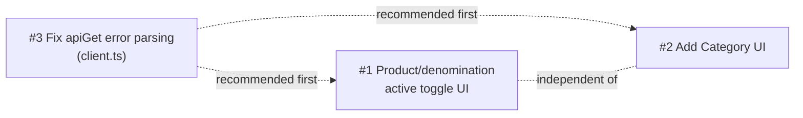

# Plan: Admin Panel UX Pass v2 — adjusted from `ui.txt`

## Context

`ui.txt` is an external UI/UX audit (1 Juli 2026) of `apps/web-admin/client`, written as if
reviewing a generic/blank admin panel. In reality this React SPA already went through a full
3-phase redesign (confirmed via git history: AppShell/Sidebar/TopBar/ThemeProvider, a shared
design-system layer — `DataTable`, `FilterBar`, `PageHeader`, `ConfirmDialog`, `EmptyState`,
`StatusBadge`, `CurrencyAmount` — and all 29 pages migrated off inline styles onto
shadcn/Tailwind). Many `ui.txt` suggestions are therefore **already shipped** (dark mode,
sidebar badges, role + 2FA on Admins, voucher usage counters, Outbox retry button, star
ratings on Reviews, the Stock progress bar, Audit Log filters). This plan filters `ui.txt`
down to what's actually still missing, verified directly against the live code
(`packages/db/src/crud/*`, `apps/web-admin/src/routes/*`,
`apps/web-admin/client/src/pages/*`), and reshapes it to fit this project's real constraints:
a single-shop SQLite (single-writer) bot, `apiGet`/`apiPost`/crud-layer conventions, no
Telegram-from-web, audit logging on every admin mutation.

**Scope decision:** frontend-first. Every item below reuses data/fields/crud helpers that
already exist — **no Prisma schema migrations**. Where a new API route is needed, it's a thin
Fastify route that calls an existing `packages/db/src/crud/*` function (same pattern as
`apps/web-admin/src/routes/catalog.ts`'s Nunjucks category route, just returning JSON instead
of a redirect). Items that genuinely need new schema fields are listed at the end as
**descoped / future phase**, not part of this plan.

**Deliverable:** this document. It is documentation only — no application code in this
commit. A future implementation session works directly off Phase 1 / Phase 2 below.

---

## Already shipped — no work needed (cross-checked against `ui.txt`)

| `ui.txt` suggestion | Where it already lives |
|---|---|
| Dark mode toggle | `ThemeProvider.tsx`, `TopBar.tsx` |
| Sidebar badge counters (pending tickets/reviews/stock) | `Sidebar.tsx` via `useOperations()`/`useInventory()` |
| Admin role select + 2FA status column | `AdminsPage.tsx:110-125` (role `Select`, options from `GET /api/admins`'s `roles` array), `AdminsPage.tsx:135-140` (2FA badge) |
| Voucher usage count (`usedCount/usageLimit`) | `VouchersPage.tsx:163` |
| Outbox "Retry failed" button | `OutboxPage.tsx:44` (`retrying` Set state), `:58-66` (retry function), `:~143-154` (button, `disabled={retrying.has(row.id)}`) → `POST /outbox/:id/retry` |
| Star rating visual on Reviews | `ReviewsPage.tsx:35-41` (`Stars` component) |
| Visual stock level indicator (progress bar) | `StockPage.tsx:169-176` |
| Category active/inactive + management model | `Category` model + `createCategory`/`updateCategory` in `packages/db/src/crud/catalog.ts:63-92,94-97` (UI wiring missing — see Phase 1) |
| Customer total-spent / last-active data | Per-customer **detail page only**: `userTotalSpent` (`packages/db/src/crud/users.ts:195-212`) + full `User` row are returned by `GET /api/users/:userId` (`apps/web-admin/src/routes/api/users.ts:31-42`). **Not** true for the Customers **list** — see Phase 2. |
| Orders table customer column | `OrdersPage.tsx:164-172` |
| Audit Log filters (admin/action/target-type/date range) | `AuditPage.tsx` — `FilterBar` (lines 90-119) is fully wired to `useAudit(filters)` via `applyFilters()`, with working pagination |

---

## Phase 1 — Catalog/Product real gaps (highest priority)

These are functional gaps the recent catalog work surfaced, not cosmetic ones.

### 1. Product active/inactive toggle (`ui.txt` Catalog #10)

`CatalogPage.tsx:285-293` only renders a static `Badge`, no control:
```tsx
{
  key: "active",
  header: "Status",
  render: (row) => (
    <Badge variant={row.isActive ? "default" : "secondary"}>
      {row.isActive ? "Active" : "Hidden"}
    </Badge>
  ),
},
```
Backend logic already exists and needs no schema change:
```ts
// packages/db/src/crud/catalog.ts:197
export async function bulkSetCatalogProductsActive(db: Db, ids: number[], isActive: boolean): Promise<number>
// packages/db/src/crud/catalog.ts:323
export async function bulkSetDenominationsActive(db: Db, ids: number[], isActive: boolean): Promise<number>
```

- Add `POST /api/catalog/products/:id/active` to `apps/web-admin/src/routes/api/catalog.ts`.
  Body `{ active: boolean }`. Handler: `await bulkSetCatalogProductsActive(prisma, [id], active)`,
  then `logAdminAction(prisma, { adminId, action: "product_active_toggle", targetType: "product",
  targetId: id, details: \`${active ? "Activated" : "Deactivated"} product "${product.name}".\` })`
  — per `docs/LOGGING.md` (full sentence, quote the user-facing name). Add a sibling route (or a
  `type` query param) for denomination rows using `bulkSetDenominationsActive`.
- Client: add shadcn `Switch` — `pnpm dlx shadcn add switch` (not yet installed; confirmed via
  `apps/web-admin/client/components.json`, which already targets the current shadcn CLI schema).
  Replace the static `Badge` in `CatalogPage.tsx`'s column with
  `<Switch checked={row.isActive} onCheckedChange={...} />`, wired to a `useMutation` that calls
  the new route and invalidates `["catalog"]`, following the same optimistic/pending-disable
  pattern already used in `OutboxPage.tsx`:
  ```tsx
  const [retrying, setRetrying] = useState<Set<number>>(new Set());
  async function retry(id: number) {
    setRetrying((s) => new Set([...s, id]));
    try {
      await apiPost(`/outbox/${id}/retry`, {});
      await refetch();
    } finally {
      setRetrying((s) => { const n = new Set(s); n.delete(id); return n; });
    }
  }
  ```
- Mirror on `ProductDetailPage.tsx`: product-level `Badge` at line 84, and the denomination
  `DataTable`'s "Active" column at line 96 (`d.isActive ? <Badge variant="default">Yes</Badge> : ...`).

### 2. Add Category (`ui.txt` Catalog #9)

`createCategory`/`updateCategory` already exist and are wired for the legacy Nunjucks route,
but not for the JSON API the React SPA uses:
```ts
// packages/db/src/crud/catalog.ts:63
export async function createCategory(db: Db, args: string | { name: string; emoji?: string | null; description?: string | null; image?: string | null; sortOrder?: number })
```
Reference implementation to mirror (already audit-logs correctly):
`apps/web-admin/src/routes/catalog.ts:171-189`:
```ts
app.post("/catalog/category", { preHandler: csrfProtect }, async (req, reply) => {
  const cat = await createCategory(prisma, { name });
  await logAdminAction(prisma, { adminId, action: "category_create", targetType: "category", targetId: cat.id, details: `Created category "${name}".` });
  ...
});
```
- Add `POST /api/catalog/categories` to `apps/web-admin/src/routes/api/catalog.ts` — same
  `createCategory` call + same `logAdminAction` message, but `reply.send({ category: cat })`
  instead of `redirectWithFlash`. Validate `name` is non-empty/trimmed before calling (mirror
  the existing `categoryId` validation pattern at `api/catalog.ts:29-35`).
- In `ProductCreatePage.tsx` (existing category `Select` at lines ~85-96), add a "+ New
  category" affordance — e.g. a sentinel `__new__` option that swaps the `Select` for an
  `Input` + Confirm/Cancel, no new dialog component needed. On submit: `useMutation` →
  `apiPost("/api/catalog/categories", { name })` → on success, invalidate `["catalog"]`,
  select the returned `category.id`, collapse back to the `Select`.

### 3. `apiGet` error parsing consistency

`src/api/client.ts`'s `apiGet` (lines 26-30) never reads the JSON error body, unlike `apiPost`
(lines 36-48):
```ts
export async function apiGet<T>(path: string): Promise<T> {
  const res = await fetch(path, { credentials: "include" });
  if (!res.ok) throw new Error(`${path} responded ${res.status}`);
  return res.json() as Promise<T>;
}
```
`apiPost` already does the try-parse-`data.error` dance. `CatalogPage.tsx` and
`ProductDetailPage.tsx` both render a raw `<p className="text-rust">` on load failure instead
of `EmptyState` — so a catalog fetch failure today shows only the generic status-code string.

- Fix once in `client.ts`: mirror `apiPost`'s parse-then-throw block onto `apiGet`.
- Swap `CatalogPage.tsx`'s and `ProductDetailPage.tsx`'s plain-text `isError` branches to
  `EmptyState` (already used everywhere else, e.g. `OutboxPage.tsx`) — icon + message +
  (where sensible) a retry action via `refetch()`.

**Recommended order** (not a hard blocker — #1 and #2 are independent of each other, but #3
is a 5-line shared-file fix that establishes the error-handling convention the new mutation
code in #1/#2 should follow, so doing it first avoids retrofitting):



---

## Phase 2 — Per-page quick wins (existing data only, no new schema)

Each item is scoped to "use what the backend already returns" or "pure client-side
derivation" — verify current state before implementing, since some neighboring items on the
same page may already be done (the Audit Log filters in this draft's earlier revision turned
out to already be fully wired — see "Already shipped").

- **Orders** (`OrdersPage.tsx`):
  - CSV export — new `GET /api/orders/export` route, reusing the same filter-building logic
    already in `apps/web-admin/src/routes/api/orders.ts:42-54` (status/q/since/until →
    `filter` object). **`listOrders` defaults to `take: opts.limit ?? 50`**
    (`packages/db/src/crud/orders.ts:936`) — the export route must pass an explicit override,
    e.g. `listOrders(prisma, { ...filter, limit: 100000 })`, or it will silently truncate to
    50 rows. Serialize to CSV with a `Content-Disposition` header — no new query logic needed
    beyond the limit override.
  - `paymentMethod` column — **confirmed not currently rendered** (`OrderRow` interface has no
    such field). The schema has it (`prisma/schema.prisma:238`,
    `paymentMethod String @default("BINANCE_PAY")`) and `listOrders`/`getOrder` return full
    Order rows (no `select`), so the API already returns it on every order — this is a
    pure-frontend addition (add to `OrderRow` interface + add a `DataTable` column).
  - Customer column: already present, no work needed (`OrdersPage.tsx:164-172`).

- **Payments** (`PaymentsPage.tsx`): order-code autosuggest on the Manual Match form — reuse
  the existing `GET /api/search` endpoint (`apps/web-admin/src/routes/api/search.ts:6-20`,
  returns `{ q, exactOrderId, users, products }`) for typeahead instead of building a new
  lookup. Add a confirmation step (`ConfirmDialog`, already a shared component) before
  submitting a match. Summary stat cards (today's total/pending/failed) computed client-side
  from the already-fetched transaction list — no new route.

- **Vouchers** (`VouchersPage.tsx`): copy-to-clipboard icon next to each code; client-side
  "expiring within 7 days" highlight using `expiresAt`; status filter (active/expired/used-up)
  derived client-side from `isActive`/`expiresAt`/`usedCount` vs `usageLimit` — all fields
  already in the row data (`VouchersPage.tsx:163` and the surrounding interface).

- **Customers** (`UsersPage.tsx`) — confirmed neither field is fetched or rendered today
  (`UserRow` interface at `UsersPage.tsx:14-22` has only `id, username, fullName, telegramId,
  role, banned, createdAt`):
  - `lastSeenAt` — pure frontend addition. The list API (`GET /api/users` →
    `searchUsers`/`listRecentUsers`, `packages/db/src/crud/users.ts:175-191`, both plain
    `findMany` with no `select`) already returns the full `User` row including `lastSeenAt` —
    just add it to `UserRow` and a `DataTable` column.
  - `totalSpent` — **not** available on the list today. The only existing helper,
    `userTotalSpent` (`packages/db/src/crud/users.ts:195-212`), is single-user (one `groupBy`
    call per user) and is only ever invoked from the per-customer detail route. Calling it once
    per row for a 20-50-row list would be an N+1 query pattern. Instead, add a new batched
    helper to `packages/db/src/crud/users.ts`:
    ```ts
    export async function totalSpentByUserIds(db: Db, userIds: number[]): Promise<Map<number, { idr: Decimal; usdt: Decimal }>>
    ```
    implemented with one `db.order.groupBy({ by: ["userId", "currency"], where: { userId: { in: userIds }, status: "DELIVERED" }, _sum: { totalAmount: true } })` call, reduced into a
    `Map`. Call it once in `GET /api/users` (`apps/web-admin/src/routes/api/users.ts:25-29`)
    after fetching the page of users, merge into the response. Add a Vitest test for the new
    helper, colocated in `crud/`, per `CLAUDE.md`'s testing convention.
  - Avatar/initial circle is pure frontend (`name[0]` in a colored `div`).

- **Support** (`SupportPage.tsx`): `SupportTicket.adminId` (`Int?`) and `status` (`String
  @default("OPEN")`) **are already on the Prisma schema** (confirmed in `prisma/schema.prisma`,
  including the `admin User? @relation("TicketAdmin", ...)` relation) — no migration needed.
  `listOpenTickets`/`getTicket` (`packages/db/src/crud/support.ts`) already return the raw
  `adminId` on each ticket (plain `findMany`/`findUnique`, no `select`); it's just absent from
  `SupportPage.tsx`'s `Ticket` interface and unrendered. No assign route exists yet (only
  `/reply` and `/close`). Add `POST /api/support/:ticketId/assign` to
  `apps/web-admin/src/routes/api/support.ts`, body `{ adminId: number | null }`, mirroring the
  existing `/close` route's shape (`support.ts:52-63`): update the ticket, then
  `logAdminAction(prisma, { adminId: req.admin!.userId, action: "ticket_assign", targetType:
  "ticket", targetId: ticketId, details: ... })` (natural sentence per `docs/LOGGING.md`, e.g.
  `Assigned ticket #${ticketId} to "${adminName}".`/`Unassigned ticket #${ticketId}.`). Client:
  add an admin-select dropdown reusing `GET /api/admins` (`apps/web-admin/src/routes/api/
  admins.ts:17-33` — the same data source `AdminsPage.tsx` already fetches), resolving
  `ticket.adminId` → admin name client-side. Status filter: `status` is already rendered via
  `StatusBadge` (`SupportPage.tsx:57-58`) — just needs a `FilterBar` control wired to it.

- **Reviews** (`ReviewsPage.tsx`): filter by rating/product using existing fields — `Stars`
  visual already shipped, skip that item.

- **Branding** (`BrandingPage.tsx`): static "recommended dimensions" hint text next to each
  upload field; simple live preview using the already-saved image URLs (plain `` bound to
  the current value, no cropper).

- **Settings** (`SettingsPage.tsx`): there is **no toast component anywhere in the codebase**
  (confirmed — no `toast`/`sonner` references) — add a lightweight inline success/error banner
  consistent with the pattern already used on `LoginPage.tsx`/`ForgotPage.tsx` (do not
  introduce a new toast library for one page) after a save mutation resolves.

- **Login/Forgot** (`LoginPage.tsx`, `ForgotPage.tsx`): both already have an error banner, a
  loading state, and (Login) a 2FA step — confirm nothing further is missing before adding a
  show/hide password icon toggle (pure client state), which is the one item genuinely absent.

---

## Explicitly descoped (not in this plan)

Flagged deliberately, not omitted by accident — these either need a new Prisma field/migration
(deploy risk per `CLAUDE.md`'s "migrate live DB + restart order-bot" rule) or are
disproportionate engineering for a single-shop SQLite (single-writer) bot:

- Low-stock threshold *persisted per product/denomination* (currently a runtime param to
  `lowStockDenominations`, not stored — needs new field)
- Stock history / audit trail table
- Support ticket `priority` + SLA fields (distinct from `adminId`/`status`, which already
  exist — see Phase 2)
- Audit log structured before/after diff columns
- Admin last-login tracking
- Storefront theme color picker / Google Fonts selector
- Real-time auto-refresh / WebSocket push / browser push notifications
- Reports: comparison-period mode, funnel analysis, PDF export
- Image cropper, drag-and-drop CSV upload
- Global keyboard shortcuts (N/S/Esc), session-timeout warning
- Customer tiering (Gold/Silver/Regular) — would need a new derived/stored field and business
  rule decision

If any of these become priorities later, they're a separate plan (each needs its own
migration + restart-order-bot deploy step called out per `CLAUDE.md`).

---

## Verification (for the future implementation session — not this one)

After each phase:
```bash
pnpm --filter @app/web-admin-client build   # must exit 0
pnpm typecheck                              # must exit 0
pnpm test                                   # vitest must stay green — add tests for new routes/components
```
Manual checks (`pnpm dev:web`, browse `http://127.0.0.1:8000`):
1. Catalog: toggle a product active/inactive, confirm it persists on reload and an `AuditLog`
   row is written.
2. Catalog: create a new category from `ProductCreatePage`, confirm it appears in the category
   `Select` immediately.
3. Force a catalog load error (e.g. stop the server briefly) → confirm `EmptyState` renders
   instead of a raw error string.
4. Orders: export CSV with more than 50 matching orders, confirm all rows are present (not
   truncated) and `paymentMethod` is a column.
5. Vouchers: confirm expiring-soon highlight and copy-to-clipboard work.
6. Customers: confirm `lastSeenAt` and `totalSpent` render correctly for a page of users, and
   that the new batched query doesn't regress page load time.
7. Support: assign a ticket to an admin, confirm it persists, audit-logs, and the dropdown
   shows the correct current assignee on reload.
8. Settings: save a field, confirm the new inline success banner appears and clears.
