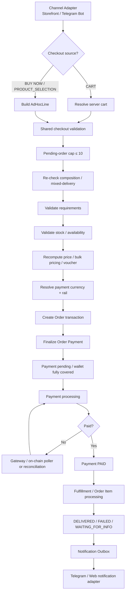
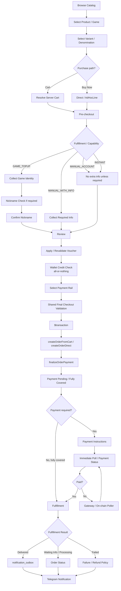

# Trustance --- Telegram Bot Architecture FINAL v3.2

> **Status:** FINAL v3.2
> **Revision:** Consolidated Shared Checkout, Payment, Runtime, State & Reliability Architecture\
> **Dokumen:** Master Telegram Bot Architecture Specification\
> **Runtime:** Node.js + TypeScript\
> **Framework:** grammY\
> **Channel:** Telegram\
> **Tujuan:** Menjadi single source of truth untuk implementasi
> `apps/order-bot` sebagai Telegram presentation/channel adapter
> Trustance.

------------------------------------------------------------------------

# 0. Source of Truth dan Scope

Dokumen ini diturunkan dari:

-   `trustance-master-architecture-prompt-1.md`
-   `trustance-frontend-architecture-FIXED-1.md`

Arsitektur bot mengikuti business/domain contract Trustance. Bot **bukan
backend kedua** dan bukan tempat business logic transaksi.

Prinsip utama:

``` text
Telegram User
    ↓
grammY Bot
    ↓
Telegram Presentation / Channel Adapter
    ↓
Application Use Cases
    ↓
Domain Services
    ↓
Infrastructure / Providers
    ↓
Database / External APIs
```

Bot harus menggunakan business logic yang sama dengan website dan admin:

``` text
Website ───────┐
Telegram Bot ──┼──> Trustance Application
Admin ─────────┘
```

Tidak boleh:

``` text
Website → Order Logic A
Telegram → Order Logic B
Admin → Order Logic C
```

------------------------------------------------------------------------

# 1. Tujuan Bot

Bot harus mampu menjadi channel commerce penuh untuk customer.

Capability minimum:

``` text
Browse catalog
View product
Select variant
Buy Now
Add to Cart
View Cart
Checkout
Enter fulfillment requirements
Game input
Nickname check
Confirm nickname
Create order
Create payment
View payment
View orders
View order detail
Submit required information
View delivery
Open ticket
View tickets
Reply ticket
FAQ / Knowledge Base
Profile
Notifications
```

Bot juga harus mampu menerima notification asynchronous dari Trustance
melalui Notification Service + Outbox.

Bot tidak boleh membuat database order sendiri.

------------------------------------------------------------------------

# 2. Golden Rules

## 2.1 Channel Rule

Telegram hanya presentation layer.

``` text
Telegram Update
    ↓
Handler
    ↓
Application Use Case
    ↓
Domain
```

Handler tidak boleh menjalankan business transaction secara langsung.

## 2.2 Provider Rule

Bot tidak boleh mengetahui provider-specific implementation logic. Bot hanya memilih payment rail melalui shared payment application service.

Dilarang:

``` text
Telegram Handler
    ↓
Digiflazz API
```

atau:

``` text
Telegram Handler
    ↓
VIPReseller API
```

Yang benar:

``` text
Telegram Handler
    ↓
NicknameService
    ↓
NicknameRouter
    ↓
Provider Adapter
```

## 2.3 Database Rule

Bot tidak boleh memiliki database order terpisah.

Gunakan database Trustance yang sama melalui application/domain layer.

## 2.4 State Rule

Conversation state Telegram hanya untuk UX flow.

Conversation state bukan source of truth untuk:

-   price
-   stock
-   reservation
-   payment
-   nickname validity
-   order status
-   fulfillment
-   refund
-   ownership

## 2.5 Security Rule

Telegram UI bukan security boundary.

Authorization tetap dilakukan backend.

------------------------------------------------------------------------

# 3. Repository Position

Target:

``` text
apps/
├── server/
├── storefront/
├── web-admin/
└── order-bot/
```

Bot:

``` text
apps/order-bot/
```

Shared:

``` text
packages/
├── core/
├── db/
├── catalog/
├── customer/
├── checkout/
├── orders/
├── payments/
├── fulfillment/
├── inventory/
├── nickname/
├── pricing/
├── ledger/
├── notifications/
├── tasks/
├── tickets/
├── support/
├── webhooks/
├── audit/
├── providers/
└── web-ui/
```

Bot tidak boleh membuat package domain baru hanya karena kebutuhan UI
Telegram.

------------------------------------------------------------------------

# 4. Recommended Folder Structure

``` text
apps/order-bot/
└── src/
    ├── index.ts
    ├── composition.ts
    │
    ├── bot/
    │   ├── create-bot.ts
    │   ├── register-handlers.ts
    │   ├── register-commands.ts
    │   ├── register-menus.ts
    │   ├── register-callbacks.ts
    │   └── register-errors.ts
    │
    ├── handlers/
    │   ├── commands/
    │   │   ├── start.ts
    │   │   ├── help.ts
    │   │   ├── shop.ts
    │   │   ├── cart.ts
    │   │   ├── orders.ts
    │   │   ├── support.ts
    │   │   ├── profile.ts
    │   │   └── cancel.ts
    │   │
    │   ├── callbacks/
    │   │   ├── catalog.ts
    │   │   ├── product.ts
    │   │   ├── cart.ts
    │   │   ├── checkout.ts
    │   │   ├── nickname.ts
    │   │   ├── order.ts
    │   │   ├── payment.ts
    │   │   ├── ticket.ts
    │   │   └── profile.ts
    │   │
    │   ├── messages/
    │   │   ├── fulfillment-input.ts
    │   │   ├── ticket-reply.ts
    │   │   └── generic-input.ts
    │   │
    │   └── payments/
    │       └── payment-status.ts
    │
    ├── conversations/
    │   ├── checkout.ts
    │   ├── game-topup.ts
    │   ├── fulfillment-info.ts
    │   ├── ticket.ts
    │   └── profile.ts
    │
    ├── keyboards/
    │   ├── main-menu.ts
    │   ├── catalog.ts
    │   ├── product.ts
    │   ├── cart.ts
    │   ├── checkout.ts
    │   ├── order.ts
    │   ├── payment.ts
    │   ├── support.ts
    │   └── common.ts
    │
    ├── views/
    │   ├── home.ts
    │   ├── catalog.ts
    │   ├── product.ts
    │   ├── cart.ts
    │   ├── checkout.ts
    │   ├── order.ts
    │   ├── payment.ts
    │   ├── ticket.ts
    │   ├── profile.ts
    │   └── errors.ts
    │
    ├── session/
    │   ├── types.ts
    │   ├── store.ts
    │   ├── keys.ts
    │   └── cleanup.ts
    │
    ├── middleware/
    │   ├── customer.ts
    │   ├── auth.ts
    │   ├── rate-limit.ts
    │   ├── correlation.ts
    │   ├── error-boundary.ts
    │   └── logging.ts
    │
    ├── adapters/
    │   ├── telegram-customer.ts
    │   ├── telegram-notifier.ts
    │   └── telegram-file.ts
    │
    ├── utils/
    │   ├── callback-data.ts
    │   ├── telegram-safe.ts
    │   ├── format-money.ts
    │   ├── format-status.ts
    │   └── pagination.ts
    │
    └── tests/
        ├── commands/
        ├── callbacks/
        ├── conversations/
        ├── views/
        └── middleware/
```

Folder dapat disesuaikan dengan codebase existing. Boundary lebih
penting daripada nama folder.

------------------------------------------------------------------------

# 5. Layer Architecture

Bot menggunakan empat layer utama.

``` text
1. Telegram Layer
2. Presentation Layer
3. Application Layer
4. Domain / Infrastructure
```

## 5.1 Telegram Layer

Berisi:

-   grammY Bot
-   Context
-   Composer
-   handlers
-   callback query
-   message update
-   keyboards
-   Telegram API interaction

## 5.2 Presentation Layer

Mengubah domain response menjadi Telegram UI.

Contoh:

``` text
Product DTO
    ↓
Product View
    ↓
Telegram Message + InlineKeyboard
```

Presentation layer boleh menentukan:

-   text
-   formatting
-   keyboard
-   pagination
-   navigation
-   Telegram-specific UX

Presentation layer tidak boleh menentukan business truth.

## 5.3 Application Layer

Contoh use case:

``` text
BrowseCatalog
GetProduct
GetProductVariant
AddCartItem
RemoveCartItem
GetCart
ValidateCart
StartCheckout
VerifyNickname
CreateOrder
CreatePayment
GetOrder
SubmitFulfillmentInfo
CreateTicket
ReplyTicket
GetNotifications
```

## 5.4 Domain / Infrastructure

Bot memanggil service yang sudah ada.

``` text
CatalogService
CustomerService
CartService
CheckoutService
OrderService
PaymentService
NicknameService
FulfillmentService
TicketService
NotificationService
```

------------------------------------------------------------------------

# 6. Dependency Direction

Wajib:

``` text
Telegram Handler
      ↓
Presentation
      ↓
Application
      ↓
Domain
      ↓
Infrastructure
```

Dilarang:

``` text
Domain
   ↓
grammY
```

Dilarang:

``` text
OrderService
   ↓
ctx.reply()
```

Dilarang:

``` text
TicketService
   ↓
bot.api.sendMessage()
```

Notification harus melalui outbox.

------------------------------------------------------------------------

# 7. Composition Root

Bot tidak boleh membuat dependency secara acak di setiap handler.

Gunakan composition root.

``` text
apps/order-bot/src/composition.ts
```

Conceptual:

``` ts
const services = {
  customerService,
  catalogService,
  cartService,
  checkoutService,
  orderService,
  paymentService,
  nicknameService,
  fulfillmentService,
  ticketService,
  knowledgeBaseService,
  notificationService,
};
```

Kemudian inject ke bot handlers.

Tidak boleh:

``` ts
const prisma = new PrismaClient();
```

di setiap handler.

Tidak boleh:

``` ts
new DigiflazzClient(...)
```

di setiap callback.

Gunakan dependency dari composition root/server.

------------------------------------------------------------------------

# 8. Single PrismaClient

Memperbaiki: §8 (Single PrismaClient), §130 (Health/Readiness).

v3.1 menyajikan dua opsi deployment (in-process vs process terpisah) tanpa
memilih. Ini diputuskan sekarang:

```text
KEPUTUSAN v1: Bot berjalan IN-PROCESS bersama server/API.

Node.js process
├── API
├── Storefront SSR (jika ada)
├── Admin
└── grammY Bot
       ↓
   satu application container
       ↓
   satu PrismaClient
```

Alasan:

```text
- $transaction pada createOrderFromCart/createOrderDirect (§30)
  membutuhkan satu Prisma boundary yang sama dengan Storefront.
- v1 belum punya kebutuhan scaling bot secara independen dari API.
- Mengurangi permukaan untuk "backend kedua" tumbuh secara diam-diam.
```

Migrasi ke process terpisah adalah keputusan v2+ yang eksplisit, bukan
default silent. Jika terjadi, bot berkomunikasi ke server melalui internal
HTTP/RPC API yang menggunakan **Error Taxonomy (§93)** sebagai kontrak,
bukan memanggil Prisma langsung.

```text
KEPUTUSAN v1: Notification Outbox Dispatcher berjalan sebagai WORKER
TERPISAH dari bot process, meskipun bot in-process dengan API.
```

Alasan:

```text
- Bot process akan restart saat deploy Telegram-side (mis. update
  keyboard, fix handler). Dispatcher tidak boleh ikut mati.
- Memisahkan retry/backoff notification dari lifecycle deploy bot.
```

```text
Domain Event → notification_outbox
                    ↓
             Dispatcher Worker
                    ↓
             Telegram Adapter
                    ↓
             Telegram Bot API
```

------------------------------------------------------------------------

### Runtime Boundary Clarification

Worker yang terpisah **tidak berbagi object instance `bot` di memory** dengan
process API/bot. Yang dibagi adalah:

```text
Telegram Bot Token
Notification Contract
Outbox Storage
Rate-Limit Policy
```

Worker membuat Telegram adapter/runtime instance sendiri dengan token yang sama.

```text
API + grammY Bot Process
        │
        └── notification_outbox

Notification Worker Process
        ↓
Telegram Adapter
        ↓
Telegram Bot API
```

Dengan demikian istilah "bot instance yang sama" tidak digunakan sebagai
dependency sharing lintas process.

# 9. grammY Bootstrap

Conceptual startup:

``` text
index.ts
    ↓
load config
    ↓
create dependencies
    ↓
create bot
    ↓
register middleware
    ↓
register commands
    ↓
register handlers
    ↓
register conversations
    ↓
register error handler
    ↓
start polling / webhook
```

Urutan middleware harus terdokumentasi dan stabil.

------------------------------------------------------------------------

# 10. Update Pipeline

``` text
Telegram Update
      ↓
Correlation ID
      ↓
Error Boundary
      ↓
Logging
      ↓
Rate Limit
      ↓
Customer Resolution
      ↓
Session / Conversation
      ↓
Command / Callback / Message Handler
      ↓
Application Use Case
      ↓
Domain
      ↓
Response DTO
      ↓
Telegram View
```

Tidak semua update membutuhkan seluruh middleware.

------------------------------------------------------------------------

# 11. Customer Identity

Telegram identity adalah channel identity.

``` text
TelegramUser
├── telegram_user_id
├── username
├── first_name
└── ...
```

Harus dipetakan ke:

``` text
Customer
```

Konsep:

``` text
Customer
├── Website Identity
└── Telegram Identity
```

Satu customer tidak boleh dibuat dua kali hanya karena menggunakan
website dan Telegram.

------------------------------------------------------------------------

# 12. Customer Resolution

Setiap protected interaction harus mengetahui customer.

Flow:

``` text
Telegram Update
    ↓
telegram_user_id
    ↓
CustomerResolver
    ↓
existing customer?
    ├── yes → use customer
    └── no  → create/link customer
```

Jangan menggunakan:

``` text
telegram_user_id = customer_id
```

sebagai business identity.

Telegram ID adalah external/channel identifier.

------------------------------------------------------------------------

# 13. `/start`

`/start` adalah entry point utama.

Kemampuan:

``` text
/start
```

Flow:

``` text
/start
   ↓
resolve customer
   ↓
show welcome
   ↓
main menu
```

Deep link dapat digunakan:

``` text
/start product_<id>
/start game_<slug>
/start order_<id>
```

Tetapi payload harus divalidasi server-side.

Jangan mempercayai ID dari deep link sebagai authorization.

------------------------------------------------------------------------

# 14. Telegram UI Architecture — Reply Keyboard, Inline Keyboard, Conversation

Telegram Bot Trustance menggunakan **empat mekanisme UI utama**:

```text
1. Reply Keyboard
   = Global / persistent navigation + simple selection

2. Inline Keyboard
   = Contextual action pada message tertentu

3. Conversation
   = Structured/free-form user input

4. Command / Deep Link
   = Direct entry point / fallback navigation
```

Jangan menyamakan keempatnya.

## 14.1 Reply Keyboard

Reply Keyboard adalah bagian penting dari UX bot Trustance, terutama karena katalog Premium Apps saat ini menggunakan pola:

```text
Product List

1. Alight Motion
2. CapCut Pro 🔥
3. Gemini AI
4. HideMyAss! (HMA) VPN
5. Leonardo AI
6. YouTube Premium

📄 Page 1/1
💡 Enter a number to view details.

[1] [2] [3] [4] [5]
[      6      ]
[      🏠 Menu      ]
```

Reply Keyboard digunakan untuk:

- Main Menu
- kategori sederhana
- product selection berbasis nomor
- game selection bila jumlah item sesuai
- navigasi global yang perlu selalu mudah diakses
- `/cancel` replacement jika UX membutuhkannya

Reply Keyboard **bukan** tempat untuk menjalankan business logic.

Flow:

```text
Reply Keyboard
    ↓
Text update
    ↓
Parse selection
    ↓
Resolve current screen/context
    ↓
Application Use Case
```

## 14.2 Inline Keyboard

Inline Keyboard digunakan untuk contextual action:

```text
CapCut Pro

30 Days
Rp30.000

[⚡ Buy Now]
[🛒 Add to Cart]
[⬅️ Back]
```

Contoh lain:

```text
Order #ORD-123

Status: PAID

[📦 View Delivery]
[🎫 Need Help]
[⬅️ Back]
```

Inline Keyboard digunakan untuk:

- Buy Now
- Add to Cart
- Variant selection
- payment
- confirm
- cancel
- pagination
- order actions
- ticket actions
- delivery actions
- back/next yang bersifat contextual

## 14.3 Conversation

Conversation digunakan saat bot membutuhkan input:

```text
Masukkan email:
```

atau:

```text
Masukkan User ID:
```

atau:

```text
Masukkan Zone ID:
```

Conversation tidak menggantikan domain/application validation.

## 14.4 Command

Command:

```text
/start
/help
/shop
/games
/cart
/orders
/support
/profile
/cancel
```

digunakan sebagai direct entry/fallback.

## 14.5 Deep Link

Deep link dapat membawa customer langsung ke resource:

```text
/start product_<id>
/start game_<slug>
/start order_<id>
```

Payload selalu divalidasi server-side.

## 14.6 Golden Rule UI

```text
Reply Keyboard
    = "Saya mau pergi ke mana / memilih item apa?"

Inline Keyboard
    = "Saya mau melakukan aksi apa?"

Conversation
    = "Saya mau memasukkan data apa?"

Command / Deep Link
    = "Saya mau langsung masuk ke flow mana?"
```

# 15. Command Surface

Minimum:

``` text
/start
/help
/shop
/games
/cart
/orders
/support
/profile
/cancel
```

Command bukan satu-satunya navigation mechanism.

User dapat berpindah melalui inline keyboard.

------------------------------------------------------------------------

# 16. Catalog Flow

Catalog berasal dari Catalog/Application Service.

Bot tidak hardcode product list.

## 16.1 Premium Apps — Current UX

Untuk Premium Apps, UX utama dapat mengikuti pola existing:

```text
🏠 Menu
 ↓
🛍 Premium Apps
 ↓
Product List
 ↓
Reply Keyboard: 1..N
 ↓
Product Detail
 ↓
Inline Keyboard Actions
```

Contoh:

```text
📦 Product List

1. Alight Motion
2. CapCut Pro 🔥
3. Gemini AI
4. HideMyAss! (HMA) VPN
5. Leonardo AI
6. YouTube Premium

📄 Page 1/1
💡 Enter a number to view details.
```

Customer menekan:

```text
2
```

Bot:

```text
current screen = PREMIUM_PRODUCT_LIST
selection = 2
 ↓
resolve product reference from current page
 ↓
GetProduct(productId)
 ↓
render product
```

Angka `2` bukan permanent product ID.

## 16.2 Dynamic Number Mapping

Jika halaman berisi:

```text
1 → product A
2 → product B
3 → product C
```

mapping hanya berlaku pada context/page tersebut.

Jangan:

```text
if message === "2" then productId = "capcut"
```

Gunakan:

```text
current catalog context
+
server-resolved item reference
```

## 16.3 Pagination

Jika product lebih banyak:

```text
📦 Product List

1. ...
2. ...
3. ...
4. ...
5. ...
6. ...

📄 Page 1/3

[1] [2] [3]
[4] [5] [6]
[⬅️ Prev] [Next ➡️]
[🏠 Menu]
```

Pagination dapat menggunakan Reply Keyboard untuk selection dan Inline Keyboard untuk navigation.

## 16.4 Game Catalog

Game Top-Up juga dapat memakai Reply Keyboard untuk pemilihan game:

```text
🎮 Game Top Up

1. Mobile Legends
2. Free Fire
3. PUBG Mobile
4. Genshin Impact
5. Arena Breakout

[1] [2] [3]
[4] [5]
[🏠 Menu]
```

Setelah game dipilih, flow game menggunakan schema/capability game.

Jadi **mekanisme memilih game dapat sama dengan Premium Apps**, tetapi purchase flow setelah pemilihan berbeda.

# 17. Product Detail

Product detail harus dapat menampilkan:

``` text
Name
Description
Variant
Price
Availability
Fulfillment hint
Requirements
```

CTA:

``` text
🛒 Add to Cart
⚡ Buy Now
```

Jika cart tidak didukung:

``` text
⚡ Buy Now
```

saja.

Behavior berdasarkan capability product, bukan nama product.

------------------------------------------------------------------------

# 18. Product Capability

Bot harus memahami capability dari domain contract.

Contoh:

``` ts
{
  requiresUserInfo: true,
  requiresNickname: false,
  supportsCart: true,
  supportsBuyNow: true,
  deliveryMode: "MANUAL_USER_INFO"
}
```

Jangan:

``` ts
if (product.name.includes("CapCut")) ...
```

------------------------------------------------------------------------

# 19. Variant Identity

Variant berbeda harus diperlakukan sebagai identity yang jelas.

Contoh:

``` text
CapCut
├── 7 Days
├── 30 Days
└── 6 Months
```

Game:

``` text
Mobile Legends
├── 86 Diamonds — Indonesia
├── 172 Diamonds — Indonesia
└── 86 Diamonds — Malaysia
```

Jangan membuat callback ambigu seperti:

``` text
buy:86
```

Gunakan internal variant ID atau signed/validated reference.

------------------------------------------------------------------------

# 20. Callback Data

Telegram callback data memiliki batas panjang yang ketat. Gunakan payload
compact, namespaced, dan versioned.

Contoh:

```text
v1:cat:premium:2
v1:buy:var_abc
v1:cart:add:var_abc
v1:ord:view:ord_123
v1:pay:view:pay_123
```

Jangan masukkan credential, payment secret, full product object, atau data
customer sensitif.

Parser menolak callback version yang tidak dikenal:

```text
unknown version
 ↓
"tombol ini sudah kedaluwarsa, silakan buka ulang"
```

Callback ID bukan authorization.

# 21. Callback Authorization

Callback ID bukan authorization.

Contoh:

``` text
callback:
ord:view:ORD-123
```

Handler harus:

``` text
resolve customer
    ↓
load order
    ↓
verify order.customerId == currentCustomer.id
    ↓
allow
```

Bukan:

``` text
callback contains order ID
→ show order
```

------------------------------------------------------------------------

# 22. Pagination

Pagination harus mendukung dua UI mechanism.

## 22.1 Reply Keyboard Pagination

Cocok untuk product/game selection:

```text
[1] [2] [3]
[4] [5] [6]
[⬅️ Prev] [Next ➡️]
[🏠 Menu]
```

## 22.2 Inline Keyboard Pagination

Cocok untuk contextual list:

```text
Orders

ORD-1001
ORD-1002
ORD-1003

[⬅️ Prev] [2] [Next ➡️]
[🏠 Menu]
```

## 22.3 Source of Truth

Page number tidak boleh dianggap sebagai permanent identity.

Setiap selection:

```text
current context
    ↓
server/catalog query
    ↓
resolve selected item
    ↓
application use case
```

Data mutable harus direvalidasi saat mutation.

# 23. Shared Checkout Contract — Storefront & Telegram Bot

Storefront React SPA dan Telegram Bot grammY adalah **dua presentation/channel
adapter** yang masuk ke business logic checkout yang sama.

Canonical business logic untuk order checkout berada pada shared application/domain
boundary, dengan implementasi order mutation di:

```text
packages/db/src/crud/orders.ts
```

termasuk command/operation yang setara dengan:

```text
createOrderFromCart
createOrderDirect
finalizeOrderPayment
```

Dengan demikian kedua front tidak boleh memiliki aturan transaksi yang berbeda.

```text
React SPA Storefront ───────┐
                            ├──> Shared Checkout / Order Logic
Telegram Bot grammY ────────┘
                                      │
                                      ├── cart validation
                                      ├── stock validation
                                      ├── voucher
                                      ├── bulk pricing
                                      ├── payment choice
                                      ├── pending-order cap
                                      ├── cart composition guard
                                      ├── order creation
                                      └── payment finalization
```

Bot tetap merupakan presentation/channel adapter. Bot tidak boleh memindahkan
business logic checkout ke handler Telegram.

## 23.1 Shared Checkout Invariant

Storefront dan Bot harus menegakkan invariant yang sama:

```text
countUserPendingOrders cap = 10
cart composition validation
stock re-check
price / promotion re-check
voucher validation
bulk pricing
fulfillment validation
manual_with_info validation
payment currency resolution
order ownership
idempotent order creation
```

Jika salah satu front menolak checkout, front lain tidak boleh mempunyai
aturan bisnis yang berbeda untuk kondisi yang sama.

## 23.2 Checkout Sources

Ada dua sumber checkout:

```text
CART
PRODUCT_SELECTION
```

Cart:

```text
cart
 ↓
createOrderFromCart(...)
```

Instant Buy / Buy Now:

```text
product + variant + quantity + requirements
 ↓
AdHocLine
 ↓
createOrderDirect(...)
```

Keduanya harus menggunakan matematika totals dan final validation yang sama.

## 23.3 Cart Is Optional, Not Mandatory

Cart bukan prerequisite untuk checkout.

```text
Storefront:
Cart checkout ───────→ createOrderFromCart
Instant Buy ─────────→ createOrderDirect

Telegram:
Cart checkout ───────→ createOrderFromCart
Buy Now ─────────────→ createOrderDirect
```

Game Top-Up v1 tetap menggunakan Buy Now / direct checkout dan tidak masuk
Cart v1.

## 23.4 Canonical Checkout Flow



## 23.5 Payment Choice

Payment method determines the order payment currency through the shared
payment-choice resolver.

Conceptually:

```text
IDR:
├── QRIS
└── PayDisini

USDT:
├── Binance Internal
├── Bybit
├── Bybit BSC
└── NOWPayments

Wallet:
├── IDR wallet credit
└── USDT wallet credit
```

The Bot may present these rails through Telegram UI, but the selected rail,
currency, amount, and eligibility remain server-authoritative.

Wallet credit is **all-or-nothing** for the relevant checkout total:

```text
wallet credit >= payable total
    → order can be fully covered

wallet credit < payable total
    → wallet credit is not partially applied
       unless the shared checkout contract explicitly supports partial credit
```

The final implementation must follow the shared checkout/payment service
contract rather than calculating payment totals in Telegram.

------------------------------------------------------------------------

# 24. Telegram Cart

Telegram may expose:

```text
Add to Cart
View Cart
Remove Item
Change Quantity
Checkout
```

However, Telegram does not own cart truth.

```text
Telegram
   ↓
Customer
   ↓
Server Cart
```

Cart server state is re-read before order creation.

For Cart v1:

```text
MANUAL_USER_INFO
MANUAL_ACCOUNT
INSTANT
```

`GAME_TOPUP` remains direct/Buy Now and is not part of Cart v1.

------------------------------------------------------------------------

# 25. Cart Validation

Before checkout:

```text
Cart
 ↓
Resolve current server state
 ↓
Re-check composition
 ↓
Price / promotion / voucher validation
 ↓
Stock / availability validation
 ↓
Eligibility validation
 ↓
Fulfillment validation
 ↓
Shared order creation
```

Possible errors include:

```text
PRICE_CHANGED
STOCK_CHANGED
PRODUCT_UNAVAILABLE
REQUIREMENT_CHANGED
FULFILLMENT_UNAVAILABLE
CONFLICT
```

The Bot must display the server result and must not silently trust stale
conversation data.

------------------------------------------------------------------------

# 26. Buy Now / Direct Checkout

Buy Now is the primary purchase path for direct products and Game Top-Up.

```text
Product / Game
 ↓
Variant / Denomination
 ↓
Requirements / Game Identity
 ↓
Nickname verification when required
 ↓
Review
 ↓
Shared final validation
 ↓
createOrderDirect(...)
 ↓
finalizeOrderPayment(...)
 ↓
Payment
 ↓
Order Detail
```

Buy Now and Cart checkout differ only in their input source:

```text
source = PRODUCT_SELECTION
```

versus:

```text
source = CART
```

They must converge on the same shared order/payment rules.

------------------------------------------------------------------------

# 27. Checkout Conversation

Conversation state exists only to collect Telegram input.

```text
checkout
├── source
├── selected variant / cart reference
├── requirement draft
├── nickname verification reference
├── voucher reference
├── payment selection
└── review
```

Conversation state is not an order and is not the source of truth.

Do not store:

```text
ctx.session.order = authoritative order
```

Instead:

```text
temporary references
      ↓
shared application use case
      ↓
re-fetch / revalidate server state
      ↓
create order
```

------------------------------------------------------------------------

# 28. Conversation State

Conversation state hanya merupakan draft/input UX. Business truth tetap berada
di server/application layer.

```ts
type CheckoutConversationState = {
  checkoutIntentId: string;
  source: "BUY_NOW" | "CART";
  variantId?: string;
  cartId?: string;
  requirementDraft?: Record<string, string>;
  nicknameVerificationId?: string;
  voucherCode?: string;
  paymentRail?:
    | "QRIS"
    | "PAYDISINI"
    | "BINANCE"
    | "BYBIT"
    | "BYBIT_BSC"
    | "NOWPAYMENTS"
    | "WALLET_CREDIT";
  step:
    | "SELECT_VARIANT"
    | "INPUT_REQUIREMENTS"
    | "VERIFY_NICKNAME"
    | "APPLY_VOUCHER"
    | "REVIEW"
    | "PAYMENT";
};
```

`checkoutIntentId` dibuat sekali untuk satu checkout attempt dan dipertahankan
selama replay/retry. Checkout baru selalu memperoleh `checkoutIntentId` baru.

Tidak menyimpan:

```text
payment secret
credential
full delivery secret
provider API key
```

Conversation state bukan authoritative order/payment state.

# 29. Checkout Confirmation / Review

Review pertama menampilkan commercial checkout tanpa mengunci payment rail:

```text
Product / Game
Variant / Denomination
Quantity
Requirements / Game Identity
Nickname, jika ada
Voucher, jika ada
Subtotal
Discount
Estimated Total
```

Actions:

```text
[✅ Lanjut ke Pembayaran]
[✏️ Ubah]
[❌ Batal]
```

Setelah customer memilih payment rail, server melakukan currency/FX resolution
dan menampilkan **Final Confirmation**:

```text
Payment Rail
Settlement Currency
FX Quote / Quote Expiry, jika applicable
Final Payable Amount
Voucher
Wallet Credit, jika applicable
```

Actions:

```text
[✅ Konfirmasi & Bayar]
[🔁 Ganti Metode]
[✏️ Ubah Pesanan]
[❌ Batal]
```

Kedua layar bersifat informational. Nilai final tetap server-authoritative
dan harus direvalidasi kembali ketika mutation dilakukan.

# 30. Final Checkout Submit

When the customer confirms:

```text
Final Confirmation
 ↓
Load checkoutIntentId
 ↓
Shared final validation
 ↓
$transaction
 ├── pending-order cap
 ├── cart composition guard
 ├── requirements validation
 ├── stock / availability re-check
 ├── voucher validation
 ├── bulk pricing
 ├── payment choice / currency / FX resolution
 ├── createOrderFromCart OR createOrderDirect
 └── finalizeOrderPayment
 ↓
Return canonical Order + Payment state
```

The same `checkoutIntentId` must be used for replay-safe order creation.

A fully wallet-covered order:

```text
wallet credit >= payable total
 ↓
no external gateway transaction
 ↓
finalize payment as covered/paid according to shared wallet policy
 ↓
fulfillment
```

Storefront dan Bot tidak boleh mengimplementasikan transaction boundary
masing-masing.

# 31. Double Submit / Idempotency

Telegram inline-button protection hanya UX protection.

Protection business mutation berada di application/database boundary:

```text
Start checkout
    ↓
create checkoutIntentId once
    ↓
Create Order command uses stable idempotency key derived from checkoutIntentId
    ↓
same conversation replay / Telegram retry
    ↓
same command + same key
    ↓
same order/result
```

Jangan membuat business idempotency key dari payload saja. Dua checkout baru
dengan payload identik tetap merupakan dua business commands yang berbeda.

```text
Checkout A
  checkoutIntentId = chk_A
  → idempotency key = order:chk_A

Checkout B
  checkoutIntentId = chk_B
  → idempotency key = order:chk_B
```

Jika payload berubah secara material sebelum order dibuat, buat checkout intent
baru. Setelah order tercipta, perubahan payment rail adalah business command
terpisah untuk `createPayment`, bukan pembuatan order kedua.

Telegram update deduplication, conversation replay safety, sequentialization,
business idempotency, dan database uniqueness adalah layer protection yang
berbeda.

# 32. Payment Rail Selection

The Bot may render the payment menu as:

```text
💳 Payment Method

[QRIS]
[PayDisini]

[USDT]
[Binance]
[Bybit]
[Bybit BSC]
[NOWPayments]

[Wallet Credit]
```

A selected rail is passed to the shared payment application layer.

The Bot does not call provider APIs directly.

Conceptually:

```text
Telegram Payment Selection
        ↓
Payment Application Service
        ↓
resolveGatewayPaymentChoice(...)
        ↓
Payment Rail / Provider Adapter
```

Provider-specific implementation remains in the infrastructure/provider layer.

------------------------------------------------------------------------

# 33. Payment Creation and Gateway Claim

Payment creation bersifat lazy dan concurrency-safe.

```text
Order created
 ↓
Payment requested
 ↓
claimGatewaySlot
 ↓
create / obtain gateway transaction
 ↓
commitGatewayResult
 ↓
persist payment reference
```

Invariant:

```text
max one PAYMENT=PENDING / PAYABLE gateway attempt per order
```

Concurrent triggers dapat berasal dari:

```text
Telegram double tap
Storefront refresh
Storefront + Telegram membuka order yang sama
Payment page reload
Retry setelah network timeout
```

Gateway claim harus berada pada transaction/locking boundary yang sama dengan
payment record mutation sehingga race tidak menghasilkan dua active payment
records.

Setiap payment attempt memiliki identity sendiri. Payment rail change setelah
order dibuat membuat payment record baru.

# 34. Payment Instructions

Depending on the selected rail, the Bot may render:

```text
QRIS / PayDisini
→ QR / payment instruction

Binance / Bybit
→ UID + payment note / required instruction

Bybit BSC
→ deposit address + network instruction

NOWPayments
→ hosted invoice URL
```

The exact instruction must come from the server/payment service.

Do not construct provider credentials, secrets, or authoritative payment
amounts in Telegram.

------------------------------------------------------------------------

# 35. Payment Status

Canonical payment lifecycle:

```text
PENDING
  ├──→ PAID
  ├──→ EXPIRED
  └──→ FAILED
```

Tidak ada transisi kembali ke `PENDING`.

Ketika customer mengganti rail sebelum payment berhasil:

```text
old payment
PENDING
 ↓
EXPIRED
reason = RAIL_CHANGED

new payment
PENDING
rail = <new rail>
```

`RAIL_CHANGED` adalah business reason/metadata, bukan status payment baru.

The Bot reads payment state from the server and may render:

```text
[💳 Bayar]
[🔄 Cek Pembayaran]
[🔁 Ganti Metode]
[❌ Batalkan]
```

# 36. Payment Confirmation — Webhook + Reconciliation

Webhook tidak dipercaya mentah.

Canonical flow:

```text
Gateway Webhook
 ↓
verify signature / authenticity
 ↓
live re-check gateway status
 ↓
persist/payment-finalization command
 ↓
finalizeOrderPayment
 ↓
PAID
```

Jika webhook hilang/terlambat:

```text
Reconciliation Poller
 ↓
check gateway / on-chain status
 ↓
finalizeOrderPayment
 ↓
PAID
```

Payment finalization wajib idempotent.

## Durable Webhook Ingress

Untuk production webhook:

```text
Gateway
 ↓
HTTP endpoint
 ↓
validate request shape + authenticity
 ↓
deduplicate event
 ↓
durably persist / enqueue event
 ↓
HTTP 200
 ↓
worker/application processing
```

HTTP 200 hanya boleh diberikan setelah event berhasil masuk ke durable queue
atau durable storage. Jangan mengandalkan fire-and-forget background Promise
setelah HTTP 200.

Jika persistence gagal:

```text
HTTP 5xx
```

agar provider tetap memiliki kesempatan melakukan retry.

Storefront dan Bot menggunakan payment finalization boundary yang sama.

# 37. Payment Expiration / Cancellation

Payment expiration:

```text
PENDING
 ↓
EXPIRED
```

Customer cancellation terhadap order sebelum pembayaran menggunakan:

```text
cancelOrder()
```

dan bukan perubahan status payment menjadi `CANCELLED`.

Payment rail change sebelum payment success:

```text
Payment A
PENDING
 ↓
changePaymentChoice()
 ↓
Payment A = EXPIRED
reason = RAIL_CHANGED
 ↓
Payment B = PENDING
rail = new rail
```

Invariant:

```text
satu order tidak boleh memiliki dua payment PENDING/payable sekaligus
```

Rail change tidak diperbolehkan setelah payment `PAID`.

FX quote dan settlement amount harus di-resolve kembali untuk rail baru bila
currency berubah.

# 38. Payment ↔ Fulfillment

Payment `PAID` does not mean `DELIVERED`.

Canonical lifecycle:

```text
Payment
 ↓
PAID
 ↓
Order / Order Item
 ↓
Fulfillment
 ↓
DELIVERED / FAILED / WAITING_FOR_INFO / PROCESSING
```

The Bot must read order-item/fulfillment state from the server.

This is especially important for:

```text
MANUAL_USER_INFO
MANUAL_ACCOUNT
INSTANT
GAME_TOPUP
```

------------------------------------------------------------------------

# 39. Fulfillment and Delivery

Fulfillment is determined by the Order Item.

```text
PAID
 ↓
Order Item Fulfillment
 ├── MANUAL_USER_INFO
 ├── MANUAL_ACCOUNT
 ├── INSTANT
 └── GAME_TOPUP
```

For instant delivery:

```text
PAID
 ↓
Fulfillment
 ↓
DELIVERED
```

For manual user info:

```text
PAID
 ↓
WAITING_FOR_INFO
 ↓
INFO_SUBMITTED
 ↓
Manual Fulfillment
 ↓
DELIVERED
```

For manual account:

```text
PAID
 ↓
Reservation / Allocation
 ↓
Admin / Manual Fulfillment
 ↓
Delivery
```

For Game Top-Up:

```text
PAID
 ↓
GAME_TOPUP fulfillment
 ↓
Provider
 ↓
DELIVERED / FAILED / PROCESSING
```

------------------------------------------------------------------------

# 40. Notification Outbox

The web and Bot must not send customer delivery notifications by bypassing
the notification domain.

Canonical pattern:

```text
Payment / Fulfillment state change
        ↓
Domain event
        ↓
notification_outbox
        ↓
Notification Service / worker
        ↓
Telegram Adapter
        ↓
Customer
```

For Storefront-originated orders:

```text
Storefront
 → shared order/payment/fulfillment
 → notification_outbox
 → order-bot notifier
 → buyer
```

For Telegram-originated orders:

```text
Telegram
 → shared order/payment/fulfillment
 → notification_outbox
 → order-bot notifier
 → buyer
```

Therefore the Bot does not need to "own" delivery merely because the order
originated in Telegram.

If Telegram delivery fails:

```text
Order remains DELIVERED
Notification remains retryable
```

Notification failure must not roll back the business transaction.

------------------------------------------------------------------------

# 41. Canonical Telegram Checkout Flow

The complete Bot flow is:



The important boundary is:

```text
Telegram UX
   ↓
Shared Checkout / Order / Payment
   ↓
Shared Fulfillment / Notification
```

not:

```text
Telegram UX
   ↓
Telegram-specific order implementation
   ↓
Telegram-specific payment implementation
```

------------------------------------------------------------------------

# 42. Order Detail

Command:

``` text
/orders
```

Menampilkan:

``` text
ORD-1001
Rp30.000
Processing
```

Detail:

``` text
Order #ORD-1001

CapCut Pro 30 Days
Status: DELIVERED

Netflix 30 Days
Status: PROCESSING
```

Order status tidak menggantikan item status.

------------------------------------------------------------------------

# 43. Mixed Order

Bot harus mampu menampilkan order dengan fulfillment berbeda.

Contoh:

``` text
Order #1001
Overall: PROCESSING

CapCut
→ DELIVERED

Netflix
→ PROCESSING

Canva
→ WAITING_FOR_INFO
```

Setiap item dapat memiliki action sendiri:

``` text
[📦 Lihat Delivery]
[✏️ Lengkapi Data]
```

------------------------------------------------------------------------

# 44. Customer Actions

Jangan menyebarkan mapping status → button di setiap handler.

Gunakan centralized action mapping.

Contoh:

``` ts
{
  type: "SUBMIT_INFO",
  label: "✏️ Lengkapi Data",
  priority: "required"
}
```

Possible actions:

``` text
SUBMIT_INFO
CONFIRM_NICKNAME
PAY_NOW
RETRY_PAYMENT
VIEW_DELIVERY
OPEN_TICKET
REQUEST_REFUND
```

------------------------------------------------------------------------

# 45. Delivery

Delivery UI berbeda berdasarkan fulfillment.

Instant:

``` text
✅ Pesanan selesai

Delivery:
<safe delivery content>
```

Manual account:

``` text
✅ Account berhasil dikirim

[🔐 Lihat Delivery]
```

Manual user info:

``` text
✅ Pesanan selesai

Informasi delivery tersedia.
```

Credential harus melalui secure delivery boundary.

------------------------------------------------------------------------

# 46. Delivery Secret

Bot harus sangat berhati-hati terhadap secret.

Jangan:

``` text
console.log(credential)
```

Jangan:

``` text
callback_data="delivery:email:password"
```

Jangan:

``` text
session.delivery = credential
```

Gunakan:

``` text
deliveryId
    ↓
authorized DeliveryService
    ↓
return delivery payload
```

Telegram message sendiri dapat menjadi sensitive surface. Tampilkan
secret hanya jika business requirement memang mengharuskannya dan
melalui authorization + audit.

------------------------------------------------------------------------

# 47. Order Ownership

Setiap order access:

``` text
Telegram User
 ↓
Customer
 ↓
Order
 ↓
verify ownership
```

Admin/operator flow harus menggunakan authorization yang berbeda.

Bot customer tidak boleh mengakses order customer lain.

------------------------------------------------------------------------

# 48. Ticketing / Support System

Ticketing adalah **first-class commerce support domain**, bukan sekadar command `/support`.

Telegram Bot adalah salah satu channel untuk Ticket domain yang sama dengan Website/Admin.

```text
Telegram
   │
   ├── Create Ticket
   ├── View Tickets
   ├── View Ticket
   ├── Reply Ticket
   ├── Resolve Ticket
   └── Reopen Ticket
   │
   ▼
Application / Ticket Service
   │
   ├── Ticket
   ├── Ticket Message
   ├── Assignment
   ├── Status
   ├── Priority
   ├── Category
   ├── Order Link
   └── Audit
   │
   ├── Website
   ├── Admin
   └── Telegram
```

Bot tidak membuat ticket domain kedua.

## 48.1 Support Entry

```text
/support
```

atau:

```text
🎫 Support
```

Menu:

```text
[🎫 My Tickets]
[➕ New Ticket]
[📚 FAQ]
[🔎 Knowledge Base]
[🏠 Menu]
```

## 48.2 Ticket Categories

Minimum:

```text
ORDER
PAYMENT
DELIVERY
GAME_TOPUP
ACCOUNT
REFUND
PRODUCT
TECHNICAL
GENERAL
```

Kategori boleh berkembang tanpa mengubah Telegram flow.

## 48.3 Ticket Status

Gunakan lifecycle yang eksplisit:

```text
OPEN
WAITING_ADMIN
WAITING_CUSTOMER
RESOLVED
CLOSED
```

Interpretasi:

```text
OPEN
= ticket baru / aktif dan belum diproses

WAITING_ADMIN
= customer membutuhkan respons admin

WAITING_CUSTOMER
= admin sudah membalas dan menunggu customer

RESOLVED
= masalah dianggap selesai tetapi masih dapat dibuka kembali

CLOSED
= ticket final/closed
```

## 48.4 Ticket Priority

Minimum:

```text
LOW
NORMAL
HIGH
URGENT
```

Priority bukan ditentukan customer secara bebas untuk mengubah SLA tanpa aturan. Admin/system dapat melakukan override berdasarkan policy.

## 48.5 Ticket Number

Setiap ticket memiliki identifier internal dan public ticket number.

Contoh:

```text
Internal:
ticket.id = UUID

Customer-facing:
TCK-20260823-00124
```

Telegram customer menggunakan public number:

```text
🎫 Ticket #TCK-20260823-00124
```

Jangan expose internal database ID jika tidak diperlukan.

## 48.6 Create Ticket

### General Ticket

```text
Support
 ↓
New Ticket
 ↓
Category
 ↓
Subject
 ↓
Message
 ↓
Create Ticket
 ↓
TCK-XXXX
 ↓
WAITING_ADMIN
```

### Telegram UX

Category dapat menggunakan Inline Keyboard:

```text
🎫 New Ticket

[📦 Order]
[💳 Payment]
[🚚 Delivery]
[🎮 Game Top Up]
[👤 Account]
[💰 Refund]
[🛍 Product]
[⚙️ Technical]
[❓ General]
```

Subject dan message menggunakan Conversation:

```text
Masukkan subject:
```

lalu:

```text
Jelaskan masalah kamu:
```

## 48.7 Order-Specific Ticket

Dari order detail:

```text
Order #ORD-1001

[🎫 Need Help]
```

Bot membuat ticket dengan context:

```text
Ticket
├── customer_id
├── order_id
└── order_item_id?
```

Jika ticket berasal dari item tertentu:

```text
Order #ORD-1001
Item #3
 ↓
Ticket
 ├── order_id = ORD-1001
 └── order_item_id = ITEM-3
```

Customer tidak boleh memilih `order_id` milik customer lain.

Server wajib melakukan authorization check.

## 48.8 Automatic Ticket Context

Jika ticket dibuat dari order, bot harus membawa context yang relevan:

```text
Order:
ORD-1001

Category:
DELIVERY

Product:
CapCut Pro

Variant:
30 Days

Order Status:
PROCESSING
```

Namun ticket message tidak boleh menyalin seluruh data internal order secara otomatis.

Hanya customer-visible information yang ditampilkan.

## 48.9 Ticket Conversation

Ticket conversation menggunakan message timeline:

```text
Ticket
  ↓
Messages
  ↓
Customer Reply
  ↓
WAITING_ADMIN
  ↓
Admin Reply
  ↓
WAITING_CUSTOMER
```

Jika customer membalas:

```text
WAITING_CUSTOMER
 ↓
WAITING_ADMIN
```

Jika admin membalas:

```text
WAITING_ADMIN
 ↓
WAITING_CUSTOMER
```

## 48.10 Closed / Reopen

Jika ticket sudah `CLOSED`:

```text
CLOSED
 ↓
Customer Reply
 ↓
REOPEN
 ↓
WAITING_ADMIN
```

Tetapi reopen harus mengikuti policy.

Contoh:

```text
CLOSED less than 7 days
→ reopen existing ticket

CLOSED older than 7 days
→ create new ticket
```

Aturan retention/reopen dapat dikonfigurasi di application layer.

## 48.11 Resolved vs Closed

Jangan langsung menyamakan:

```text
RESOLVED = CLOSED
```

Gunakan:

```text
RESOLVED
= problem solved, customer may still reopen

CLOSED
= conversation finalized
```

Contoh:

```text
Admin:
"Masalah sudah kami selesaikan."

→ RESOLVED

Customer:
"Masih belum bisa."

→ OPEN / WAITING_ADMIN
```

## 48.12 Ticket Message Types

Minimum:

```text
CUSTOMER
ADMIN
SYSTEM
```

Secara internal message dapat memiliki:

```text
sender_type
message_type
body
attachment
internal
created_at
```

Contoh `message_type`:

```text
TEXT
IMAGE
DOCUMENT
SYSTEM_EVENT
```

File/attachment harus melalui attachment storage abstraction.

## 48.13 Internal Note

Admin dapat membuat:

```text
INTERNAL_NOTE
```

Internal note:

```text
internal = true
```

Tidak boleh dikirim ke Telegram customer.

Customer hanya melihat:

```text
CUSTOMER
ADMIN
SYSTEM
```

yang memang customer-visible.

## 48.14 Ticket Assignment

Ticket harus dapat di-assign kepada operator/admin.

Conceptual:

```text
Ticket
├── assigned_to_user_id
├── assigned_at
└── assigned_by
```

Flow:

```text
New Ticket
 ↓
Unassigned
 ↓
Admin Assignment
 ↓
Assigned Operator
 ↓
Handling
```

Assignment bukan tanggung jawab Telegram customer bot.

Bot hanya menampilkan status customer-visible bila diperlukan.

## 48.15 Ticket SLA / Aging

Ticket service sebaiknya menyimpan timestamp:

```text
created_at
first_response_at
resolved_at
closed_at
last_customer_message_at
last_admin_message_at
```

Dengan data tersebut Admin dapat menghitung:

```text
First Response Time
Resolution Time
Ticket Age
```

Telegram tidak menghitung SLA sendiri.

## 48.16 Ticket List

`🎫 My Tickets`:

```text
🎫 My Tickets

TCK-00124
💳 Payment
🟡 WAITING_ADMIN

TCK-00119
📦 Order
🟢 RESOLVED

TCK-00111
🎮 Game Top Up
⚫ CLOSED
```

Gunakan Inline Keyboard untuk membuka ticket:

```text
[TCK-00124]
[TCK-00119]
[TCK-00111]

[⬅️ Prev] [Next ➡️]
[🏠 Menu]
```

## 48.17 Ticket Detail

```text
🎫 Ticket #TCK-00124

Category:
💳 Payment

Status:
🟡 WAITING_ADMIN

Subject:
Payment belum terdeteksi

------------------

You:
Saya sudah bayar...

Admin:
Kami sedang mengecek pembayaran...

------------------

[💬 Reply]
[✅ Tandai Selesai]
[⬅️ My Tickets]
```

## 48.18 Reply Ticket

Saat customer menekan:

```text
[💬 Reply]
```

Bot masuk Conversation:

```text
Silakan kirim pesan.
```

Customer dapat mengirim:

```text
Text
Image
Document
```

Message masuk ke Ticket Service.

Flow:

```text
Telegram Update
 ↓
Ticket Conversation
 ↓
Validate ticket ownership
 ↓
CreateTicketMessage
 ↓
Update ticket status
 ↓
Outbox
 ↓
Admin Notification
```

## 48.19 Customer Close

Customer dapat meminta/menutup ticket melalui:

```text
[✅ Tandai Selesai]
```

Jika policy mengizinkan:

```text
WAITING_CUSTOMER
 ↓
RESOLVED
```

Untuk kasus tertentu hanya admin yang boleh melakukan final `CLOSED`.

## 48.20 Ticket Notification

Ticket notification tidak dikirim langsung dari TicketService.

```text
TicketService
 ↓
Domain Event
 ↓
Notification Outbox
 ↓
NotificationService
 ↓
Telegram Adapter
 ↓
Customer
```

Contoh event:

```text
TICKET_CREATED
TICKET_ASSIGNED
TICKET_REPLY
TICKET_WAITING_CUSTOMER
TICKET_RESOLVED
TICKET_CLOSED
TICKET_REOPENED
```

## 48.21 Idempotency

Ticket message harus idempotent.

Telegram update yang sama tidak boleh menghasilkan dua message:

```text
Telegram update_id
 ↓
Idempotency check
 ↓
CreateTicketMessage
```

Gunakan unique constraint / deduplication key yang sesuai.

## 48.22 Authorization

Customer hanya boleh:

```text
View own tickets
View own ticket messages
Reply own tickets
Close own tickets
Reopen eligible own tickets
```

Customer tidak boleh:

```text
View other customer tickets
Change assignment
Change priority arbitrarily
Add internal notes
Change admin status
```

Authorization dilakukan di application layer.

## 48.23 Ticket ↔ Order Relation

Relasi:

```text
Customer
   │
   └── Tickets
          │
          ├── Order?
          │     └── Order Item?
          │
          └── Messages
```

Satu ticket dapat terkait dengan satu order dan optional satu order item.

Jangan mengikat ticket hanya ke order karena masalah dapat terjadi pada level item.

## 48.24 Ticket ↔ Fulfillment

Ticket dapat menjadi escalation channel untuk fulfillment:

```text
Order
 ↓
Fulfillment
 ↓
FAILED / DELAYED
 ↓
Customer opens ticket
 ↓
Ticket
 ↓
Admin resolves
```

Ticket tidak boleh melakukan provider fulfillment secara langsung.

## 48.25 Ticket ↔ Payment

Jika payment bermasalah:

```text
Payment
 ↓
PAYMENT_PENDING / FAILED
 ↓
Customer
 ↓
Need Help
 ↓
Ticket category = PAYMENT
 ↓
Ticket linked to Order
```

Ticket Service dapat membaca payment state melalui application service, bukan mengakses provider credential langsung.

## 48.26 Ticket ↔ Game Top-Up

Jika nickname benar tetapi top-up gagal:

```text
Game Top-Up
 ↓
Provider FAILED
 ↓
Order status = FAILED
 ↓
Customer
 ↓
🎫 Need Help
 ↓
Ticket category = GAME_TOPUP
 ↓
Linked Order + Order Item
```

Admin dapat melihat context provider/reference melalui Admin UI, tetapi customer hanya melihat informasi yang aman.

## 48.27 Ticket Data Model

Conceptual model:

```text
Ticket
├── id
├── ticket_number
├── customer_id
├── order_id?
├── order_item_id?
├── category
├── subject
├── status
├── priority
├── assigned_to_user_id?
├── created_at
├── updated_at
├── first_response_at?
├── resolved_at?
├── closed_at?
├── last_customer_message_at?
└── last_admin_message_at?

TicketMessage
├── id
├── ticket_id
├── sender_type
├── sender_user_id?
├── message_type
├── body
├── internal
├── created_at
└── metadata?

TicketAttachment
├── id
├── ticket_message_id
├── storage_key
├── mime_type
├── size
└── metadata?
```

Actual Prisma schema tetap menjadi source of truth.

## 48.28 Bot File Structure

```text
apps/order-bot/src/
├── commands/
│   └── support.ts
│
├── callbacks/
│   └── ticket.ts
│
├── conversations/
│   └── ticket.ts
│
├── keyboards/
│   └── ticket.ts
│
├── views/
│   └── ticket.ts
│
├── messages/
│   └── ticket-reply.ts
│
└── use-cases/
    ├── create-ticket.ts
    ├── get-ticket.ts
    ├── list-tickets.ts
    ├── reply-ticket.ts
    ├── resolve-ticket.ts
    ├── close-ticket.ts
    └── reopen-ticket.ts
```

Jika business/application use case sebenarnya berada di shared `packages/core` atau server application layer, bot layer hanya memanggil contract tersebut.

## 48.29 Ticket Architecture Rule

```text
Telegram Ticket UI
        ↓
Bot Adapter
        ↓
Application Ticket Use Case
        ↓
Ticket Domain
        ↓
Database / Outbox
        ↓
Notification
```

Bukan:

```text
Telegram Handler
 ↓
Prisma.ticket.create()
```

dan bukan:

```text
Telegram Handler
 ↓
bot.api.sendMessage()
```

untuk notification domain event.

## 48.30 FAQ / Knowledge Base Escalation

Support entry:

```text
Support
 ↓
FAQ / Knowledge Base
 ↓
Article
 ↓
Still Need Help?
 ↓
New Ticket
```

Contoh:

```text
❓ Cara top up Mobile Legends
❓ Cara menemukan User ID
❓ Pembayaran expired
❓ Lama manual delivery
❓ Cara submit email
❓ Nickname salah
❓ Kebijakan refund
```

Knowledge Base dapat dipakai bersama Website.

Jangan membangun AI support agent kompleks pada tahap awal.

Gunakan:

```text
Search / Category / Article
        ↓
Escalate to Ticket
```

## 48.31 Ticket Observability

Log minimal:

```text
ticket.created
ticket.assigned
ticket.message.created
ticket.status.changed
ticket.reopened
ticket.resolved
ticket.closed
ticket.notification.queued
ticket.notification.sent
ticket.notification.failed
```

Semua log memakai:

```text
correlation_id
customer_id
ticket_id
order_id?
```

Jangan log:

```text
password
payment secret
provider credential
sensitive customer data
```

## 48.32 Ticket E2E Test Matrix

Minimum:

```text
Create general ticket
Create order-linked ticket
List own tickets
Open own ticket
Reject other customer's ticket
Reply ticket
Admin reply → customer notification
Customer reply → WAITING_ADMIN
Admin reply → WAITING_CUSTOMER
Resolve ticket
Close ticket
Reopen eligible closed ticket
Internal note hidden from customer
Attachment accepted
Duplicate Telegram update ignored
Ticket notification retry
```

# 49. Nickname Verification Lifecycle

Melengkapi: gap di antara §48 dan §87 (section 49-86 hilang di v3.1).
Referensi silang: §28 (`nicknameVerificationId`), §93 (`NICKNAME_INVALID`,
`NICKNAME_EXPIRED`), Golden Rules #16-#17 di §177.

## P2.1 Data Model

```text
NicknameVerification
├── id
├── customer_id
├── game_id
├── user_id            (input customer)
├── zone_id?           (input customer, jika game membutuhkan)
├── nickname_result     (hasil dari provider)
├── provider            (VIPReseller | Melostore | Kokinpay | ...)
├── status               PENDING | VERIFIED | INVALID | EXPIRED
├── verified_at?
├── expires_at
└── correlation_id
```

## P2.2 TTL

```text
Default TTL: 10 menit sejak verified_at.

Nilai final adalah operational parameter (dapat dikonfigurasi per game
bila provider tertentu punya nickname yang lebih cepat berubah), bukan
architectural invariant yang di-hardcode di banyak tempat.
```

## P2.3 Flow

```text
Input User ID (+ Zone ID jika perlu)
    ↓
NicknameService.verify(gameId, userId, zoneId)
    ↓
NicknameRouter
    ↓
Provider Adapter (dengan fallback sesuai Scenario E di §133)
    ↓
NicknameVerification { status: VERIFIED, expires_at }
    ↓
Tampilkan ke customer:
    "Ilham — apakah benar?"
    ↓
Customer confirm
    ↓
nicknameVerificationId disimpan di checkout conversation state (§28)
```

## P2.4 Revalidasi Wajib

```text
Titik revalidasi (WAJIB, bukan opsional):
1. Saat customer menekan [Konfirmasi & Bayar] (§145) —
   cek nicknameVerification.status == VERIFIED
   dan expires_at > now().
2. Saat fulfillment benar-benar mengeksekusi top-up ke provider
   (setelah PAID) — jika sudah lewat TTL, JANGAN top-up langsung ke
   nickname lama. Lakukan re-verify singkat; jika berbeda dari yang
   dikonfirmasi customer, tahan order → masuk Admin Task
   (kategori NICKNAME_MISMATCH), order TIDAK dieksekusi otomatis.
```

## P2.5 Error Mapping

```text
Provider timeout / semua provider gagal → NICKNAME_INVALID (non-retryable
  dari sisi UX; lihat Scenario F §133) atau PROVIDER_UNAVAILABLE
  (retryable) tergantung jenis kegagalan.
Verification ada tapi expired saat dipakai → NICKNAME_EXPIRED
  → bot meminta customer verifikasi ulang, TIDAK auto-retry silent.
```

------------------------------------------------------------------------


# 50. Game Input Schema Resolution

Melengkapi gap section 49-86. Referensi: §138 (Shared Game Contract).

```text
Game dipilih
    ↓
GET GameInputSchema(gameId)
    ↓
GameInputSchema { gameId, fields: GameInputField[] }
    ↓
Bot me-render conversation SATU FIELD PER STEP mengikuti urutan fields[],
bukan satu form gabungan bebas.
    ↓
Setiap field divalidasi client-side ringan (type, required) untuk UX,
DAN divalidasi ulang di application layer sebelum disimpan sebagai draft.
    ↓
Setelah semua required field terisi → lanjut ke Nickname Check
    (jika game.requiresNickname == true) atau langsung ke Review.
```

```text
Jangan hardcode "User ID lalu Zone ID" sebagai urutan universal.
Urutan render field HARUS mengikuti urutan array `fields` dari schema,
supaya game yang butuh field berbeda (mis. Region tanpa Zone) tidak
memerlukan percabangan kode per game.
```

------------------------------------------------------------------------


# 51. Fulfillment Info Submission

Melengkapi gap section 49-86. Referensi: §5.3 (`SubmitFulfillmentInfo`),
§39 (Manual User Info flow), §97 (idempotency).

```text
Trigger: Order Item berstatus WAITING_FOR_INFO (lihat state machine
di P6.2).

Flow:
Order #ORD-1001, Item #2 → WAITING_FOR_INFO
    ↓
Bot menampilkan required fields (dari requirement schema product,
BUKAN dari game input schema — dua schema ini berbeda domain)
    ↓
Conversation: satu field per step
    ↓
Submit
    ↓
Application: SubmitFulfillmentInfo(orderId, orderItemId, values)
    ↓
Server validasi ulang (format email, dsb) — idempotent by
(orderItemId, submission) supaya retry Telegram tidak membuat dua
submission
    ↓
Order Item: WAITING_FOR_INFO → INFO_SUBMITTED
    ↓
Masuk antrian manual fulfillment (Task Queue, §159)
```

```text
Aturan:
- Customer BOLEH mengedit info sebelum admin mulai memproses
  (status masih INFO_SUBMITTED, belum PROCESSING).
- Setelah admin mulai memproses (order item = PROCESSING), edit
  lewat bot TIDAK diizinkan; customer harus membuka ticket
  (kategori ORDER) untuk perubahan.
- Field sensitif (password akun yang dibeli, dsb.) tidak pernah
  diminta sebagai "requirement" di flow ini; requirement adalah data
  YANG DIBUTUHKAN untuk mengirim produk ke customer, bukan sebaliknya.
```

------------------------------------------------------------------------


# 68. FX / Currency Resolution untuk Rail Non-IDR

Rail berbasis USDT:

```text
Payment-choice resolver
 ↓
FX quote IDR → USDT
 ↓
quote expiresAt
 ↓
Final Confirmation
 ↓
re-resolve / validate quote
 ↓
lock quote for payment settlement
```

Quote review bukan final truth.

Jika quote expired ketika customer menekan `[Konfirmasi & Bayar]`:

```text
expired quote
 ↓
obtain fresh quote
 ↓
recalculate settlement amount
 ↓
render Final Confirmation again
```

Pisahkan secara eksplisit:

```text
Order commercial total
    =
harga produk / discount / voucher dalam currency order

Payment settlement amount
    =
jumlah yang harus dibayarkan pada selected rail
```

Contoh:

```text
Order total:             Rp30.000
Selected rail:           USDT
Locked FX quote:         1 USDT = Rp47.619
Settlement amount:       0.63 USDT
```

Rounding harus dilakukan oleh shared pricing/payment package dan identik di
Storefront maupun Bot.

------------------------------------------------------------------------

# 87. Notifications

Bot menerima notification melalui NotificationService.

Event:

``` text
ORDER_CREATED
PAYMENT_PENDING
PAYMENT_PAID
ORDER_WAITING_INFO
ORDER_PROCESSING
ORDER_DELIVERED
ORDER_FAILED
REFUND_COMPLETED

TICKET_CREATED
TICKET_REPLY
TICKET_ASSIGNED
TICKET_WAITING_CUSTOMER
TICKET_RESOLVED
TICKET_CLOSED
```

Bot adalah delivery channel.

------------------------------------------------------------------------

# 88. Outbox

Flow:

``` text
Domain Event
 ↓
Outbox
 ↓
Outbox Dispatcher
 ↓
NotificationService
 ↓
Telegram Adapter
 ↓
bot.api.sendMessage()
```

Benefit:

-   retry
-   reliability
-   decoupling
-   auditability

------------------------------------------------------------------------

# 89. Notification Idempotency

Notification retry tidak boleh menyebabkan infinite duplicate.

Gunakan event/outbox identity.

Contoh:

``` text
notification_outbox_id
event_id
recipient
channel
status
attempts
```

Jika delivery retry:

``` text
same event
→ same logical notification
```

------------------------------------------------------------------------

# 90. Session Storage

Bot session menjadi satu root state model.

```ts
type BotSession = {
  customerId?: string;
  screen: TelegramScreen;

  listSnapshot?: {
    token: string;
    context: string;
    itemRefs: string[];
    expiresAt: string;
  };

  navigation?: {
    stack: TelegramScreen[];
  };

  checkout?: CheckoutConversationState;

  ticket?: {
    ticketId?: string;
    step?: string;
  };
};
```

Input precedence:

```text
1. active grammY conversation
   ↓
2. valid listSnapshot for current screen
   ↓
3. fallback / command routing
```

Saat conversation aktif, reply-keyboard number selection tidak boleh mengambil
alih input conversation.

Production session storage tidak boleh default in-memory.

Rekomendasi:

```text
Redis atau Prisma-backed bot_session
+
TTL eksplisit
```

Recommended defaults:

```text
screen/navigation idle TTL      = 24 jam
checkout conversation idle TTL  = 15 menit
```

Session menyimpan references/drafts, bukan payment secret, credential, atau
full delivery secret.

# 91. Session Cleanup

Session harus dibersihkan:

``` text
checkout completed
checkout cancelled
ticket completed
timeout
user /cancel
```

Stale conversation tidak boleh mengganggu flow baru.

------------------------------------------------------------------------

# 92. `/cancel`

`/cancel` harus dapat menghentikan UX conversation.

Contoh:

``` text
/cancel
```

Response:

``` text
Flow dibatalkan.

[🏠 Menu Utama]
```

Cancel UX state tidak otomatis membatalkan order/payment yang sudah
dibuat.

Jika ingin cancel order:

``` text
Order → Cancel Order use case
```

secara terpisah.

------------------------------------------------------------------------

# 93. Error Taxonomy

Bot menggunakan normalized API/application errors.

Minimal:

``` text
AUTH_REQUIRED
FORBIDDEN
NOT_FOUND
VALIDATION_ERROR
CONFLICT
RATE_LIMITED
PAYMENT_FAILED
PAYMENT_EXPIRED
STOCK_CHANGED
RESERVATION_EXPIRED
NICKNAME_INVALID
NICKNAME_EXPIRED
FULFILLMENT_FAILED
PROVIDER_UNAVAILABLE
INTERNAL_ERROR
```

Mapping Telegram terpusat.

------------------------------------------------------------------------

# 94. Customer-Friendly Error

Internal:

``` text
PROVIDER_TIMEOUT
```

Customer:

``` text
Layanan sedang sibuk. Silakan coba lagi beberapa saat.
```

Jangan menampilkan:

``` text
VIPReseller HTTP 504
API key ...
```

atau stack trace.

------------------------------------------------------------------------

# 95. Rate Limiting

Sensitive bot operations harus rate limited:

``` text
nickname check
login/linking
checkout
payment
ticket spam
```

Rate limit harus berbasis customer/Telegram identity dan operation
sesuai kebutuhan.

Contoh:

``` text
nickname: 5 requests / minute
```

Nilai final harus mengikuti operational requirement, bukan hardcoded
sebagai invariant arsitektur.

------------------------------------------------------------------------

# 96. Double Submit

Inline button harus mencegah accidental double click pada UX.

Namun protection utama ada di backend:

``` text
Create Order
    ↓
Idempotency Key
```

Bot tidak boleh membuat order kedua jika Telegram update/retry yang sama
diproses kembali.

------------------------------------------------------------------------

# 97. Idempotency

Mutation penting:

``` text
create order
create payment
submit fulfillment info
create refund
ticket mutation bila memiliki side effect penting
```

gunakan idempotency sesuai business command.

Retry request yang sama:

``` text
same Idempotency-Key
```

Payload berubah:

``` text
new business command
→ new key
```

------------------------------------------------------------------------

# 98. Telegram Update Deduplication

Production transport:

```text
Webhook
```

Update handling:

```text
Telegram webhook
 ↓
validate shape
 ↓
persist/enqueue durably
 ↓
update_id uniqueness check
 ↓
application processing
```

`update_id` wajib memiliki unique constraint / durable dedup store dengan TTL
operasional, misalnya 24 jam.

Duplicate update:

```text
same update_id
 ↓
skip
```

Update deduplication tidak menggantikan business-command idempotency.

```text
Telegram update dedup
+
conversation replay safety
+
sequentialize
+
business idempotency
+
database constraints
```

adalah lapisan berbeda.

# 99. Correlation ID

Setiap operation penting memiliki correlation ID.

Contoh:

``` text
Telegram Update
correlationId = tg-abc123
```

Log:

``` text
tg-abc123
  ├── customer resolution
  ├── checkout
  ├── create order
  └── create payment
```

Correlation ID untuk tracing.

Idempotency key untuk business deduplication.

Jangan mencampur keduanya.

------------------------------------------------------------------------

# 100. Logging

Structured logs:

``` text
timestamp
level
event
correlationId
telegramUserId
customerId
orderId?
paymentId?
ticketId?
durationMs
```

Jangan log:

``` text
password
credential
payment secret
API key
full delivery secret
```

------------------------------------------------------------------------

# 101. Telegram API Error Handling

Jika Telegram API gagal:

``` text
sendMessage failed
    ↓
log normalized error
    ↓
retry policy sesuai error
```

Jangan membuat domain transaction gagal hanya karena notification
Telegram gagal.

Contoh:

``` text
Order DELIVERED
 ↓
Telegram notification failed
```

Order tetap:

``` text
DELIVERED
```

Notification masuk retry/outbox.

------------------------------------------------------------------------

# 102. Message Editing vs New Message

Prefer editing message untuk navigation yang sifatnya ephemeral:

``` text
Category
→ Product
→ Variant
```

Gunakan new message jika:

-   message merupakan notification
-   delivery
-   ticket reply
-   important event
-   Telegram message tidak cocok diedit

Tujuan: mengurangi chat clutter tanpa mengorbankan auditability/UX.

------------------------------------------------------------------------

# 70A. Telegram Screen State

Bot harus mengetahui screen/context aktif agar Reply Keyboard number selection tidak ambigu.

Conceptual:

```ts
type TelegramScreen =
  | "HOME"
  | "PREMIUM_CATEGORY"
  | "PREMIUM_PRODUCT_LIST"
  | "PREMIUM_PRODUCT_DETAIL"
  | "PREMIUM_VARIANT"
  | "GAME_LIST"
  | "GAME_DETAIL"
  | "GAME_DENOMINATION"
  | "CHECKOUT"
  | "GAME_INPUT"
  | "NICKNAME_CONFIRMATION"
  | "ORDER_REVIEW"
  | "PAYMENT"
  | "ORDERS"
  | "ORDER_DETAIL"
  | "TICKETS"
  | "TICKET_DETAIL"
  | "PROFILE";
```

Number input:

```text
"2"
```

harus diproses berdasarkan:

```text
current screen
+
current page
+
current catalog snapshot/reference
```

Contoh:

```text
PREMIUM_PRODUCT_LIST + page=1 + selection=2
    ↓
resolve product
```

Tidak boleh memiliki global mapping:

```text
"2" → CapCut
```

karena product list dapat berubah.

# 70B. Telegram / grammY Runtime Constraints

Mandatory runtime rules:

```text
callback_query
 → prompt answerCallbackQuery

conversation
 → replay-safe externalized side effects

chat
 → sequentialize per chat/customer

webhook
 → durable enqueue before HTTP 200

update_id
 → durable deduplication

customer commerce
 → private chat only

outgoing Telegram
 → central rate limit + retry_after + 403 deactivation
```

These controls protect Telegram session correctness and delivery reliability;
they do not replace application-level idempotency or database constraints.

------------------------------------------------------------------------

# 103. Navigation Model

Bot menggunakan navigation stack sederhana.

Contoh:

``` text
HOME
 ↓
CATEGORY
 ↓
PRODUCT
 ↓
VARIANT
 ↓
CHECKOUT
```

Back button:

``` text
⬅️ Kembali
```

Tidak boleh mengandalkan Telegram history sebagai application state.

------------------------------------------------------------------------

# 104. Menu Isolation

Customer-facing bot tidak boleh menampilkan admin operation.

Admin bot adalah keputusan arsitektur terpisah.

Jika kelak ada admin Telegram:

``` text
Admin Telegram Channel
    ↓
Admin Application Service
    ↓
Authorization
```

Jangan memasukkan admin actions ke customer handler dengan hidden
buttons.

------------------------------------------------------------------------

# 105. Authorization

Authorization backend harus memeriksa:

``` text
customer ownership
customer permissions
admin permissions
ticket ownership
order ownership
delivery access
```

Telegram middleware hanya membantu UX.

------------------------------------------------------------------------

# 106. Channel Context

Application command dapat membawa:

``` ts
{
  channel: "TELEGRAM",
  actorType: "CUSTOMER",
  customerId,
  correlationId
}
```

Channel context berguna untuk:

-   pricing
-   analytics
-   audit
-   notification preference
-   business rule jika memang diperlukan

Jangan membuat business logic Telegram-specific tanpa kebutuhan domain
yang jelas.

------------------------------------------------------------------------

# 107. Channel-Aware Pricing

Pricing engine dapat menerima:

``` text
channel = TELEGRAM
```

Contoh:

``` text
Website → price A
Telegram → price B
Reseller → price C
```

Namun harga tetap dihitung server-side.

Bot tidak boleh menghitung final price sendiri.

------------------------------------------------------------------------

# 108. Analytics

Bot dapat mengirim event:

``` text
product_view
game_view
search
add_to_cart
checkout_started
checkout_failed
payment_started
payment_paid
order_delivered
nickname_check
nickname_check_failed
ticket_created
```

Jangan mengirim:

``` text
password
credential
payment secret
full delivery secret
sensitive fulfillment data
```

Analytics bukan transaction truth.

------------------------------------------------------------------------

# 109. Search

Search dapat digunakan untuk:

``` text
product
category
game
knowledge base
```

Bot UX:

``` text
🔎 Cari Produk
```

Input masuk ke search use case.

Jangan mengambil seluruh catalog lalu melakukan business filtering
kompleks di bot jika server dapat melakukan query.

------------------------------------------------------------------------

# 109A. Storefront ↔ Telegram Shared Checkout Boundary

Storefront dan Telegram memiliki UX yang berbeda, tetapi keduanya harus
berakhir pada kontrak transaksi yang sama.

## Storefront

```text
/cart
 ↓
checkoutView()
 ↓
voucher preview, jika ada
 ↓
payment selection
 ↓
performCheckout
   / performWalletCheckout
   / performDirectCheckout
 ↓
shared order transaction
 ↓
pay page
 ↓
gateway / payment status
 ↓
fulfillment
 ↓
notification_outbox
```

Instant Buy storefront:

```text
InstantBuyPage
 ↓
performDirectCheckout
   / performDirectWalletCheckout
 ↓
AdHocLine
 ↓
shared order/payment logic
```

## Telegram

```text
Catalog
 ↓
Buy Now / Cart
 ↓
requirements / nickname
 ↓
review
 ↓
payment selection
 ↓
shared order transaction
 ↓
payment instructions
 ↓
poller / reconciliation
 ↓
fulfillment
 ↓
notification_outbox
```

## Convergence

Keduanya bertemu pada:

```text
createOrderFromCart(...)
createOrderDirect(...)
finalizeOrderPayment(...)
```

dan pada invariant:

```text
pending-order cap
cart composition guard
stock validation
voucher
bulk pricing
payment currency
wallet-credit policy
order ownership
idempotency
payment finalization
fulfillment state
notification outbox
```

### Gateway Claim

Gateway transaction creation harus menggunakan satu concurrency-safe claim
mechanism.

```text
Storefront ───────┐
                   ├──> claimGatewaySlot
Telegram Bot ─────┘
                   ↓
             one gateway tx
```

Dengan demikian membuka order yang sama dari dua channel tidak boleh
menghasilkan dua gateway transactions.

### Gateway Verification

Webhook dari gateway tidak langsung dianggap sebagai pembayaran final:

```text
Webhook
 ↓
Verify signature
 ↓
Live gateway re-check
 ↓
finalizeOrderPayment
 ↓
PAID
```

Jika webhook tidak sampai:

```text
Reconciliation Poller
 ↓
gateway / on-chain status
 ↓
finalizeOrderPayment
```

### Cross-Channel Delivery

Order yang dibuat melalui Storefront dapat selesai melalui worker/notifier
yang digunakan Bot, dan order yang dibuat melalui Bot dapat tetap dibaca oleh
Storefront.

```text
Storefront Order
      ↓
Shared Order / Payment / Fulfillment
      ↓
notification_outbox
      ↓
Order Bot / Notification Adapter
      ↓
Telegram Buyer
```

Web tidak mengirim Telegram message secara langsung.

# 110. Game Top-Up UX

Game Top-Up dan Premium Apps memiliki **commerce backbone yang sama**, tetapi **purchase flow tidak identik**.

## 78.1 Yang Sama

Keduanya mengikuti:

```text
Catalog
 ↓
Product / Game
 ↓
Variant / Denomination
 ↓
Pre-checkout validation
 ↓
Review
 ↓
Create Order
 ↓
Payment
 ↓
Fulfillment
 ↓
Order Status
 ↓
Notification
```

Keduanya menggunakan:

```text
Customer
Catalog
Pricing
Checkout
Order
Payment
Fulfillment
Notification
Ticket
```

## 78.2 Yang Berbeda

Premium Apps bergantung pada `fulfillment_type`.

```text
MANUAL_USER_INFO
MANUAL_ACCOUNT
INSTANT
```

Game Top-Up:

```text
GAME_TOPUP
```

Game Top-Up memiliki domain-specific requirement:

```text
Game identity
User ID
Zone ID / Server / Region jika diperlukan
Nickname verification jika game mendukung/mewajibkan
```

## 78.3 Premium Apps Flow

### A. Manual User Info

```text
Premium Apps
 ↓
Product
 ↓
Variant
 ↓
Buy Now
 ↓
Input Requirements
    └── email / username / required data
 ↓
Review
 ↓
Create Order
 ↓
Payment
 ↓
PAID
 ↓
WAITING_FOR_INFO / INFO_SUBMITTED
 ↓
Admin / Manual Fulfillment
 ↓
DELIVERED
 ↓
Telegram Notification
```

### B. Manual Account

```text
Premium Apps
 ↓
Product
 ↓
Variant
 ↓
Buy Now
 ↓
Review
 ↓
Create Order
 ↓
Payment
 ↓
PAID
 ↓
Reservation / Admin Task
 ↓
Manual Account Fulfillment
 ↓
Delivery
 ↓
DELIVERED
```

### C. Instant Premium

```text
Premium Apps
 ↓
Product
 ↓
Variant
 ↓
Buy Now
 ↓
Review
 ↓
Create Order
 ↓
Payment
 ↓
PAID
 ↓
Instant Fulfillment
 ↓
DELIVERED
```

Tidak semua Premium Apps membutuhkan nickname.

## 78.4 Game Top-Up Flow

```text
🎮 Game Top Up
 ↓
Select Game
 ↓
Select Denomination
 ↓
Input Game Identity
 ↓
Nickname Check
 ↓
Confirm Nickname
 ↓
Review
 ↓
Create Order
 ↓
Payment
 ↓
PAID
 ↓
Game Top-Up Fulfillment
 ↓
Provider
 ↓
DELIVERED / FAILED / PENDING
 ↓
Telegram Notification
```

Contoh Mobile Legends:

```text
Game
 ↓
Mobile Legends
 ↓
86 Diamonds
 ↓
User ID
 ↓
Zone ID
 ↓
Nickname Check
 ↓
"Ilham — apakah benar?"
 ↓
Confirm
 ↓
Review
 ↓
Payment
```

## 78.5 Kenapa Tidak Disamakan 100%?

Karena requirement sebelum order berbeda.

Premium:

```text
Product capability
→ requirements berdasarkan product
```

Game:

```text
Game input schema
→ player identity
→ nickname verification
```

Jadi:

```text
Shared Commerce Core
        │
        ├── Premium Purchase Flow
        │      ├── Manual User Info
        │      ├── Manual Account
        │      └── Instant
        │
        └── Game Top-Up Flow
               ├── Game Input
               ├── Nickname
               └── Top-Up Fulfillment
```

## 78.6 UX Layer

Selection awal dapat sama:

```text
Reply Keyboard
```

Contoh:

```text
Premium:
1. Alight Motion
2. CapCut Pro
3. Gemini AI

Game:
1. Mobile Legends
2. Free Fire
3. PUBG Mobile
```

Namun setelah item dipilih:

```text
Premium
→ Variant
→ Requirement jika perlu
→ Review

Game
→ Denomination
→ Player Input
→ Nickname
→ Review
```

Jadi **UI primitive dapat sama, tetapi flow state berbeda berdasarkan domain capability**.

# 111. Game Region / Country

Jika denomination berbeda berdasarkan negara/server:

``` text
Mobile Legends
├── 86 Diamonds — Indonesia
├── 86 Diamonds — Malaysia
└── 86 Diamonds — Philippines
```

UI harus menampilkan region dengan jelas.

Jangan:

``` text
86 Diamonds
```

tanpa context jika variant sebenarnya berbeda.

------------------------------------------------------------------------

# 112. Manual Product UX

Manual product flow adalah bagian dari Premium Apps dan bukan Game Top-Up.

## 80.1 Manual User Info

```text
Product
 ↓
Variant
 ↓
Requirements
 ↓
Input
 ↓
Review
 ↓
Create Order
 ↓
Payment
 ↓
WAITING_FOR_INFO / INFO_SUBMITTED
 ↓
Manual Fulfillment
```

Contoh:

```text
CapCut Pro
30 Days
 ↓
Masukkan email
 ↓
Review
 ↓
Payment
```

## 80.2 Manual Account

```text
Product
 ↓
Variant
 ↓
Review
 ↓
Create Order
 ↓
Payment
 ↓
Manual Fulfillment
 ↓
Delivery
```

Customer tidak perlu memasukkan email jika product contract memang tidak membutuhkannya.

## 80.3 Instant Premium

```text
Product
 ↓
Variant
 ↓
Review
 ↓
Create Order
 ↓
Payment
 ↓
Instant Fulfillment
 ↓
Delivery
```

## 80.4 Important

Jangan membuat satu universal flow seperti:

```text
Product
→ Email
→ User ID
→ Nickname
→ Payment
```

Semua field harus berasal dari product/game capability dan requirement schema.

# 80A. Premium Apps vs Game Top-Up — Flow Matrix

| Step | Premium Apps | Game Top-Up |
|---|---|---|
| Entry | Premium Apps | Game Top Up |
| Selection | Product | Game |
| Variant | Variant / duration / region | Denomination / region |
| Requirements | Product requirement schema | Game input schema |
| User data | Hanya jika diperlukan | Player identity biasanya wajib |
| Nickname | Biasanya tidak | Jika game/provider mendukung atau mewajibkan |
| Review | Ya | Ya |
| Create Order | Ya | Ya |
| Payment | Sama | Sama |
| Fulfillment | Manual User Info / Manual Account / Instant | GAME_TOPUP |
| Provider | Fulfillment provider | Top-up provider |
| Delivery | Product-specific | Top-up result |
| Notification | Sama | Sama |
| Ticket | Sama | Sama |

## 80A.1 Shared Backbone

```text
                    Customer
                       ↓
                    Catalog
                       ↓
               Product / Variant
                       ↓
                Pre-checkout
                       ↓
                    Review
                       ↓
                  Create Order
                       ↓
                    Payment
                       ↓
                  Fulfillment
                       ↓
                  Order Status
                       ↓
                 Notification
```

## 80A.2 Branching Point

Perbedaan terjadi pada:

```text
Product Capability / Game Schema
```

Premium:

```text
MANUAL_USER_INFO
MANUAL_ACCOUNT
INSTANT
```

Game:

```text
GAME_TOPUP
```

Dengan demikian jangan membuat dua sistem checkout yang sepenuhnya terpisah.

Gunakan:

```text
Shared Checkout Infrastructure
+
Domain-specific pre-checkout flow
+
Domain-specific fulfillment
```

## 80A.3 Recommended Application Boundary

```ts
purchase.start(...)
purchase.collectRequirements(...)
purchase.verifyNickname(...)
purchase.review(...)
purchase.createOrder(...)
purchase.createPayment(...)
```

Tetapi implementasi requirement berbeda:

```text
Premium:
collectProductRequirements()

Game:
collectGameIdentity()
verifyNickname()
```

Setelah itu keduanya masuk:

```text
review
→ createOrder
→ payment
→ fulfillment
```

# 113. Order Status Rendering

Order status:

``` text
UNPAID
PAID
QUEUED
WAITING_FOR_INFO
INFO_SUBMITTED
PROCESSING
DELIVERED
FAILED
CANCELLED
EXPIRED
```

Order item status:

``` text
QUEUED
PROCESSING
WAITING_FOR_INFO
WAITING_FOR_ADMIN
DELIVERED
FAILED
CANCELLED
REFUNDED
```

Payment:

``` text
PENDING
PAID
FAILED
EXPIRED
```

Refund:

``` text
NONE
REQUESTED
PROCESSING
REFUNDED
FAILED
```

Jangan membuat satu status universal.

------------------------------------------------------------------------

# 113A. Canonical State Machines — v3.2 Authority

Section ini adalah source of truth untuk lifecycle status. Section lain yang
menyebut status harus mengikuti tabel ini.

## Order

```text
UNPAID → PAID
UNPAID → EXPIRED
UNPAID → CANCELLED

PAID → PROCESSING
PROCESSING → DELIVERED
PROCESSING → FAILED
```

`WAITING_FOR_INFO` dan `INFO_SUBMITTED` bukan Order status.

## Order Item

```text
QUEUED → PROCESSING
QUEUED → WAITING_FOR_INFO
WAITING_FOR_INFO → INFO_SUBMITTED
INFO_SUBMITTED → WAITING_FOR_ADMIN
WAITING_FOR_ADMIN → PROCESSING
PROCESSING → DELIVERED
PROCESSING → FAILED
FAILED → CANCELLED
DELIVERED → REFUNDED
```

## Payment

```text
PENDING → PAID
PENDING → EXPIRED
PENDING → FAILED
```

Rail change sebelum payment success:

```text
PENDING → EXPIRED
reason = RAIL_CHANGED
```

kemudian payment record baru dibuat.

## Ticket

```text
(create) → WAITING_ADMIN
WAITING_ADMIN → WAITING_CUSTOMER
WAITING_CUSTOMER → WAITING_ADMIN
WAITING_ADMIN → RESOLVED
WAITING_CUSTOMER → RESOLVED
RESOLVED → WAITING_ADMIN
RESOLVED → CLOSED
CLOSED → WAITING_ADMIN
```

`OPEN` tidak digunakan sebagai active lifecycle state.

## Refund

```text
NONE → REQUESTED
REQUESTED → PROCESSING
PROCESSING → REFUNDED
PROCESSING → FAILED
FAILED → REQUESTED
```

## Fulfillment Provider View

Untuk `GAME_TOPUP`:

```text
PROCESSING → PROVIDER_SUCCESS → Order Item DELIVERED
PROCESSING → PROVIDER_FAILED  → Order Item FAILED
PROCESSING → PROVIDER_PENDING → tetap PROCESSING
```

------------------------------------------------------------------------

# 114. Status Badge

Centralized mapper:

``` text
UNPAID → ⏳ Belum Dibayar
PAID → ✅ Dibayar
PROCESSING → ⚙️ Diproses
WAITING_FOR_INFO → 📝 Menunggu Data
DELIVERED → 📦 Selesai
FAILED → ❌ Gagal
CANCELLED → 🚫 Dibatalkan
EXPIRED → ⌛ Kedaluwarsa
```

Label dapat berubah secara UX tanpa mengubah domain enum.

------------------------------------------------------------------------

# 115. Refund

Refund memiliki lifecycle tunggal:

```text
NONE
 ↓
REQUESTED
 ↓
PROCESSING
 ↓
REFUNDED
```

Failure path:

```text
PROCESSING → FAILED
FAILED → REQUESTED
```

`REFUNDED` berarti dana sudah dikembalikan.

Flow:

```text
Order
 ↓
Request Refund
 ↓
RefundService
 ↓
REQUESTED
 ↓
PROCESSING
 ↓
REFUNDED
```

Order cancellation tidak sama dengan refund.

# 116. Inventory

Bot tidak menghitung stock.

Jika product:

``` text
availability = OUT_OF_STOCK
```

Bot menampilkan:

``` text
Stok sedang habis.
```

Reservation ditentukan server.

Countdown Telegram hanya UI.

------------------------------------------------------------------------

# 117. Reservation

Jika server memberikan:

``` json
{
  "status": "ACTIVE",
  "expiresAt": "..."
}
```

bot boleh menampilkan countdown.

Jika countdown habis:

``` text
timer UI = 0
```

tidak berarti reservation pasti expired.

Bot harus revalidate server.

------------------------------------------------------------------------

# 118. Concurrency

Bot dapat menerima dua callback hampir bersamaan.

Contoh:

``` text
User taps Buy twice
```

Backend harus mencegah duplicate order.

Bot UX hanya lapisan tambahan:

``` text
disable / edit button
```

Correctness tetap backend.

------------------------------------------------------------------------

# 119. 409 Conflict

Jika backend mengembalikan:

``` text
409 CONFLICT
```

bot:

``` text
Data sudah berubah.

Silakan muat ulang informasi terbaru.
```

Jangan silently overwrite.

------------------------------------------------------------------------

# 120. Notifications Menu

``` text
🔔 Notifications
```

Unread count server-authoritative.

Bot dapat menampilkan:

``` text
🔔 Notifications (3)
```

Setelah read:

``` text
markNotificationRead()
```

Bukan hanya menghapus badge secara lokal.

------------------------------------------------------------------------

# 121. Profile

Minimum:

``` text
👤 Profile

Name
Telegram username
Email jika terhubung
Customer ID / masked identifier
```

Actions:

``` text
🔗 Link Website Account
🔔 Notification Preferences
🎮 Saved Game Identities
```

Sensitive information tidak boleh ditampilkan berlebihan.

------------------------------------------------------------------------

# 122. Website Account Linking

Jika linking account tersedia:

``` text
Telegram
 ↓
Link Account
 ↓
secure verification flow
 ↓
Customer identity unified
```

Jangan menggunakan email saja sebagai bukti kepemilikan tanpa
verification.

Detail mekanisme verification adalah dependency/decision point jika
belum ditentukan backend.

------------------------------------------------------------------------

# 123. Saved Game Identity

Jika domain mendukung saved game identities:

``` text
Customer
 ↓
Saved Game Identity
 ├── gameId
 ├── userId
 ├── zoneId?
 └── label
```

Bot dapat:

``` text
🎮 My Game IDs
```

Namun nickname validity tetap server-authoritative.

------------------------------------------------------------------------

# 124. Ticket Attachments

Jika ticket mendukung attachment:

``` text
Telegram file
 ↓
Attachment validation
 ↓
Backend storage
 ↓
TicketMessage attachment
```

Validasi:

``` text
MIME
size
security scanning
private URL
```

Jangan membuat permanent public URL untuk sensitive attachment.

------------------------------------------------------------------------

# 125. Telegram File Security

Jangan menganggap `file_id` sebagai permanent business storage contract.

Jika file harus dipersistenkan:

``` text
Telegram
 ↓
download/transfer
 ↓
private backend storage
 ↓
attachment record
```

Jika attachment hanya notification UX, gunakan lifecycle yang sesuai.

------------------------------------------------------------------------

# 126. Bot Error Boundary

Semua unhandled error harus masuk central error handler.

``` text
try handler
 ↓
error
 ↓
normalize
 ↓
log
 ↓
customer-safe response
```

Jangan mengirim stack trace ke Telegram.

------------------------------------------------------------------------

# 127. Error Correlation

Untuk internal error:

``` text
Terjadi kesalahan.

Kode referensi:
ABC123
```

Customer dapat memberikan kode ke support tanpa melihat internal
details.

------------------------------------------------------------------------

# 128. Webhook vs Polling

Production Telegram transport:

```text
Webhook
```

Webhook endpoint:

```text
receive update
 ↓
validate
 ↓
durably enqueue / persist
 ↓
HTTP 200
 ↓
worker/application processing
```

HTTP 200 tidak boleh dikirim sebelum durable enqueue/persistence berhasil.

Bot menggunakan `sequentialize()` atau equivalent per chat/customer key untuk
mencegah session corruption ketika beberapa update datang hampir bersamaan.

Every `callback_query` must receive `answerCallbackQuery` promptly, preferably
through early middleware, before long-running application work.

Customer commerce interactions are restricted to:

```text
ctx.chat.type === "private"
```

Group/supergroup/channel updates are dropped or redirected to DM.

Production rate limiting must separately consider:

```text
incoming customer operations
outgoing Telegram API traffic
gateway/provider traffic
```

For Telegram API responses:

```text
429 → respect retry_after
403 → mark channel inactive; do not retry forever
```

# 129. Graceful Shutdown

Bot harus menangani:

``` text
SIGTERM
SIGINT
```

Flow:

``` text
stop accepting updates
 ↓
finish active work
 ↓
close Telegram transport
 ↓
cleanup session/resources
 ↓
shutdown
```

Jangan memutus process secara kasar saat mutation sedang berjalan jika
dapat dihindari.

------------------------------------------------------------------------

# 130. Health / Readiness

Jika bot menjadi process/service terpisah:

``` text
health
readiness
```

harus dapat dipantau.

Health tidak berarti Telegram API pasti reachable.

Pisahkan:

``` text
process health
database health
Telegram API health
provider health
```

------------------------------------------------------------------------

# 131. Observability

Structured logs:

```text
timestamp
level
event
correlationId
telegramUserId
customerId
orderId?
paymentId?
ticketId?
durationMs
```

Never log:

```text
password
credential
payment secret
API key
full delivery secret
```

Mandatory outbox metrics:

```text
outbox_oldest_unsent_age_seconds
outbox_backlog_size
outbox_dead_letter_count
```

After the configured retry limit (default 10 attempts), notification events
move to `DEAD_LETTER` and trigger an ops alert.

Telegram outgoing rate limits must be enforced centrally by the Dispatcher,
including handling of HTTP 429 `retry_after` and HTTP 403 channel deactivation.

# 132. Testing Strategy

## Unit

Test:

``` text
callback parser
keyboard builders
view formatters
status mapper
error mapper
pagination
session state
```

## Application integration

Test:

``` text
catalog
checkout
order
payment
nickname
ticket
```

## Bot integration

Test:

``` text
/start
browse catalog
product
Buy Now
game input
nickname
checkout
payment
orders
ticket
```

------------------------------------------------------------------------

# 133. Critical Bot Acceptance Scenarios

## Scenario A --- Premium Manual Email

``` text
Telegram
→ Product
→ Buy Now
→ email input
→ Review
→ Create Order
→ Payment
→ PAID
→ WAITING_FOR_INFO / INFO_SUBMITTED
→ Admin fulfills
→ DELIVERED
→ Telegram notification
```

## Scenario B --- Premium Manual Account

``` text
Telegram
→ Product
→ Buy Now
→ Create Order
→ Payment
→ PAID
→ Reservation
→ Admin assigns
→ Delivery
→ DELIVERED
```

## Scenario C --- Premium Instant

``` text
Telegram
→ Product
→ Buy Now
→ Create Order
→ Payment
→ PAID
→ Fulfillment
→ DELIVERED
```

## Scenario D --- Game Top-Up

``` text
Telegram
→ Select game
→ Select denomination
→ User ID / Zone
→ Nickname check
→ Confirm nickname
→ Review
→ Create Order
→ Payment
→ Digiflazz
→ Delivered
```

## Scenario E --- Nickname Fallback

``` text
VIPReseller
→ timeout
→ Melostore
→ success
→ normalized result
→ Telegram
```

## Scenario F --- Invalid Target

``` text
Nickname check
→ INVALID_TARGET
→ stop
→ customer-friendly error
```

Tidak fallback ke provider lain jika error memang non-retryable.

## Scenario G --- Digiflazz Failure

``` text
Payment PAID
→ Digiflazz FAILED
→ retry/reconciliation
→ permanent failure
→ Admin Task / Refund
→ customer notification
```

## Scenario H --- Mixed Order

``` text
Order
├── Premium manual
├── Premium instant
└── Game top-up
```

Bot menampilkan status per order item.

## Scenario I --- Ticket from Telegram

``` text
Telegram
→ Create Ticket
→ same Customer
→ same Ticket Domain
→ Admin reply
→ Telegram notification
```

------------------------------------------------------------------------

# 134. Testing Matrix

Original coverage:

```text
Customer       Telegram identity links to existing customer
Customer       New Telegram user creates customer
Catalog        Active / inactive product
Catalog        Variant selection
Cart           Add / remove / server revalidation
Checkout       Buy Now / Cart / missing requirement / double submit
Nickname       Success / timeout fallback / invalid target / TTL expired
Payment        Pending / paid / failed / expired
Order          Ownership / mixed fulfillment
Fulfillment    Manual info / manual account / instant / game top-up
Ticket         Create / reply / reopen / internal note hidden
Notification   Outbox retry
Security       Unauthorized order / secret not logged
Concurrency    Duplicate callback
Error          Unknown error safe response
```

v3.2 additional mandatory tests:

```text
Conversation    Replay does not change checkoutIntentId
Conversation    Replay does not create a second order
Session         Restart does not lose persistent checkout state before TTL
Session         stale listSnapshot token is rejected
Runtime         callback_query is acknowledged promptly
Runtime         concurrent updates in same chat are sequentialized
Runtime         duplicate update_id is ignored
Runtime         group chat commerce updates are rejected
Runtime         Telegram 403 marks channel inactive
Payment         rail change leaves no two PENDING payments
Payment         old rail payment is EXPIRED with reason RAIL_CHANGED
Payment         rail change cannot happen after PAID
Payment         FX quote expiry forces re-quote
Payment         webhook event is durable before HTTP 200
Payment         webhook + poller racing stays idempotent
Nickname        expired verification at fulfillment is revalidated
Nickname        mismatch after revalidation enters admin handling
Ticket          create starts WAITING_ADMIN
Ticket          customer "close" action resolves, not final-closes
Ticket          resolved ticket can reopen according to policy
Message         payloads above Telegram limits are chunked safely

# 135. Anti-Patterns

Dilarang:

``` text
handler → Prisma
```

``` text
handler → Digiflazz
```

``` text
handler → VIPReseller
```

``` text
handler → create Order database record directly
```

``` text
OrderService → bot.api.sendMessage
```

``` text
TicketService → ctx.reply
```

``` text
Telegram session → authoritative order
```

``` text
callback_data → credential
```

``` text
callback_data → payment secret
```

``` text
Telegram ID = Customer ID
```

``` text
product.name → fulfillment behavior
```

``` text
PAID → automatically show Delivered
```

``` text
local countdown → assume reservation expired
```

------------------------------------------------------------------------

# 136. Shared Contract dengan Frontend

Bot dan storefront harus berbagi:

``` text
domain schema
validation
status
error taxonomy
capability
API/application contract
```

UI berbeda:

``` text
Web:
form
dropdown
card
modal

Telegram:
inline keyboard
reply keyboard
conversation
message
callback query
```

Jangan memaksa UI web menjadi UI Telegram.

------------------------------------------------------------------------

# 137. Shared Product Contract

Contoh:

``` ts
type ProductCapability = {
  requiresUserInfo: boolean;
  requiresNickname: boolean;
  supportsCart: boolean;
  supportsBuyNow: boolean;
  deliveryMode:
    | "MANUAL_USER_INFO"
    | "MANUAL_ACCOUNT"
    | "INSTANT"
    | "GAME_TOPUP";
};
```

Bot hanya mengonsumsi contract.

------------------------------------------------------------------------

# 138. Shared Game Contract

``` ts
type GameInputField = {
  key: string;
  label: string;
  type: "text" | "number";
  required: boolean;
};

type GameInputSchema = {
  gameId: string;
  fields: GameInputField[];
};
```

Telegram renderer:

``` text
schema
 ↓
conversation
 ↓
values
 ↓
application validation
```

------------------------------------------------------------------------

# 139. Shared Error Contract

Bot dan storefront menerima error yang sama:

``` text
NICKNAME_INVALID
PAYMENT_EXPIRED
STOCK_CHANGED
RESERVATION_EXPIRED
FULFILLMENT_FAILED
PROVIDER_UNAVAILABLE
```

Presentation mapping berbeda.

------------------------------------------------------------------------

# 140. Shared Status Contract

Jangan membuat:

``` text
TelegramOrderStatus
```

yang berbeda dari:

``` text
WebOrderStatus
```

Gunakan domain status yang sama.

Bot hanya membuat human-readable presentation.

------------------------------------------------------------------------

# 141. Bot-to-Application Interface

Ideal:

``` ts
interface TrustanceApplication {
  catalog: CatalogApplication;
  customer: CustomerApplication;
  cart: CartApplication;
  checkout: CheckoutApplication;
  orders: OrderApplication;
  payments: PaymentApplication;
  nickname: NicknameApplication;
  fulfillment: FulfillmentApplication;
  tickets: TicketApplication;
  support: SupportApplication;
  notifications: NotificationApplication;
}
```

Bot bergantung pada interface/application contract, bukan implementation
detail.

------------------------------------------------------------------------

# 142. Handler Pattern

Conceptual:

``` ts
async function onProduct(
  ctx: BotContext,
  app: TrustanceApplication,
) {
  const productId = parseCallback(ctx);

  const result = await app.catalog.getProduct({
    customerId: ctx.customer.id,
    productId,
    channel: "TELEGRAM",
  });

  await renderProduct(ctx, result);
}
```

Handler:

``` text
parse
validate context
call application
render
```

Handler tidak:

``` text
calculate price
reserve inventory
call provider
write DB
```

------------------------------------------------------------------------

# 143. Conversation Pattern

Conversation:

``` text
ask
 ↓
receive
 ↓
validate
 ↓
store temporary input
 ↓
next step
```

Pada final submit:

``` text
conversation state
 ↓
build command
 ↓
server validation
 ↓
idempotent mutation
```

Jangan menganggap data yang divalidasi lima menit lalu masih valid saat
order dibuat.

------------------------------------------------------------------------

# 144. Checkout Review

Sebelum create order, bot harus menampilkan:

``` text
Review Pesanan

Product
Variant
Quantity
Requirements
Nickname
Price
Total
```

Untuk game:

``` text
Game
Denomination
User ID
Zone ID
Nickname
Region
Price
```

Kemudian:

``` text
[✅ Konfirmasi & Bayar]
[✏️ Ubah]
[❌ Batal]
```

------------------------------------------------------------------------

# 145. Server Revalidation Before Submit

Saat:

``` text
[✅ Konfirmasi & Bayar]
```

application layer harus melakukan final validation:

``` text
product active
variant active
price
availability
requirements
nickname
eligibility
channel
promotion
```

Bot tidak boleh hanya menggunakan data review lama.

------------------------------------------------------------------------

# 146. Idempotent Checkout Submit

Checkout submission uses:

```text
checkoutIntentId
        ↓
stable order idempotency key
        ↓
createOrderFromCart / createOrderDirect
```

The checkout intent is unique per purchase attempt.

Replay/retry:

```text
same checkoutIntentId
→ same idempotency key
→ same business result
```

New purchase:

```text
new checkoutIntentId
→ new order idempotency key
```

Payment creation has a separate idempotency key:

```text
payment command
→ paymentAttemptId / payment idempotency key
```

Changing payment rail does not create a new order, but it does create a new
payment command/attempt after the old payment is made non-PENDING.

# 147. Notification Deep Links

Notification dapat membawa user kembali ke relevant resource.

Contoh:

``` text
[📦 Lihat Order]
```

Namun deep link tetap harus melakukan ownership check.

------------------------------------------------------------------------

# 148. Notification Types

Customer notification:

``` text
Order created
Payment pending
Payment paid
Waiting for info
Order processing
Order delivered
Order failed
Refund updated
Ticket reply
```

Bot notification handler tidak boleh mengubah order state.

------------------------------------------------------------------------

# 149. Notification Failure Isolation

Jika:

``` text
Telegram unavailable
```

maka:

``` text
OrderService
```

tidak boleh rollback transaction.

Notification akan retry via outbox.

------------------------------------------------------------------------

# 150. Provider Isolation

Bot tidak tahu:

``` text
Digiflazz SKU
VIPReseller game code
Kokinpay code
Melostore code
```

Bot hanya tahu:

``` text
product
variant
game
nickname result
order
payment
```

Provider mapping tetap backend.

------------------------------------------------------------------------

# 151. Security Checklist

Bot production harus memastikan:

``` text
[ ] Customer ownership enforced
[ ] Admin authorization separated
[ ] Callback payload validated
[ ] Callback authorization enforced
[ ] Sensitive data never in callback
[ ] Sensitive data never in logs
[ ] Payment secret protected
[ ] Credential protected
[ ] Rate limiting
[ ] Double-submit protection
[ ] Idempotency
[ ] Error sanitization
[ ] Attachment validation
[ ] Telegram API errors isolated
```

------------------------------------------------------------------------

# 152. Performance

Jangan melakukan:

``` text
callback
→ load entire catalog
→ filter in memory
```

Prefer:

``` text
callback
→ application query
→ only required data
```

Gunakan pagination.

Cache dapat digunakan untuk catalog metadata, tetapi transaction truth
tetap server-authoritative.

------------------------------------------------------------------------

# 153. Caching

Bot boleh menggunakan cache untuk:

``` text
catalog metadata
categories
static knowledge base
```

Jangan menganggap cache sebagai source of truth untuk:

``` text
price
stock
payment
order
reservation
nickname
fulfillment
```

------------------------------------------------------------------------

# 154. Telegram Message Size

Formatter harus memperhatikan batas Telegram message.

Jika order/ticket terlalu panjang:

``` text
paginate
```

atau:

``` text
split safe chunks
```

Jangan memotong credential secara sembarangan.

------------------------------------------------------------------------

# 155. HTML / Markdown Formatting

Gunakan satu formatter abstraction.

Contoh:

``` text
formatProduct()
formatOrder()
formatPayment()
formatTicket()
```

Jangan menyebarkan escaping Telegram di seluruh handler.

Semua user-provided content harus di-escape sesuai parse mode.

------------------------------------------------------------------------

# 156. User Input Validation

Input Telegram selalu untrusted.

Validasi:

``` text
type
length
format
allowed characters
business constraints
```

Server tetap melakukan validation ulang.

------------------------------------------------------------------------

# 157. Spam Protection

Support dan free-text handler harus melindungi dari spam.

Contoh:

``` text
ticket message
search
nickname check
```

Rate limit + cooldown bila diperlukan.

------------------------------------------------------------------------

# 158. Admin Notification

Customer bot hanya menerima customer-visible notifications.

Admin operational notifications sebaiknya melalui admin channel/system
yang terpisah.

Contoh internal:

``` text
FAILED_TOPUP_REVIEW
MANUAL_DELIVERY
REFUND_REVIEW
```

masuk Task Queue/Admin, bukan customer bot.

------------------------------------------------------------------------

# 159. Task Queue Integration

Bot tidak menjadi task queue.

Flow:

``` text
Fulfillment failure
 ↓
TaskService
 ↓
Admin Task
```

Jika customer punya ticket:

``` text
Task
 ↔
Ticket
```

Bot hanya menerima customer-facing update.

------------------------------------------------------------------------

# 160. Audit

Operasi penting harus dapat diaudit:

``` text
Create Order
Create Payment
Cancel Order
Request Refund
Submit Fulfillment Info
View Sensitive Delivery
Create Ticket
Reply Ticket
Link Account
```

Bot harus meneruskan actor/channel context:

``` text
actorType = CUSTOMER
channel = TELEGRAM
customerId
telegramUserId
correlationId
```

------------------------------------------------------------------------

# 161. Architecture Flow --- Full Commerce

``` text
Telegram
   ↓
grammY
   ↓
Middleware
   ↓
Handler
   ↓
Application Use Case
   ↓
Domain Validation
   ↓
Transaction
   ├── Order
   ├── Payment
   ├── Reservation
   └── Outbox
   ↓
Worker / Provider
   ↓
Fulfillment
   ↓
Order Item Status
   ↓
Notification Event
   ↓
Outbox
   ↓
Telegram Notification
```

------------------------------------------------------------------------

# 162. Architecture Flow --- Game Top-Up

``` text
Telegram
 ↓
Game
 ↓
Variant
 ↓
Input Schema
 ↓
User ID / Zone / Server
 ↓
NicknameService
 ↓
NicknameRouter
 ├── VIPReseller
 ├── Melostore
 └── Kokinpay
 ↓
Confirmed
 ↓
Review
 ↓
Create Order
 ↓
Payment
 ↓
PAID
 ↓
FulfillmentEngine
 ↓
TopupProvider
 ↓
Digiflazz
 ↓
Success / Pending / Failed
 ↓
Order Item
 ↓
Notification
 ↓
Telegram
```

------------------------------------------------------------------------

# 163. Architecture Flow --- Ticket

``` text
Telegram
 ↓
Create Ticket
 ↓
TicketService
 ↓
Ticket
 ↓
Outbox
 ↓
Admin notification

Admin Reply
 ↓
TicketService
 ↓
TicketMessage
 ↓
Outbox
 ↓
Telegram Notification
```

------------------------------------------------------------------------

# 164. Architecture Flow --- Manual Delivery

``` text
Telegram
 ↓
Product
 ↓
Requirements
 ↓
Create Order
 ↓
Payment
 ↓
PAID
 ↓
Task Queue
 ↓
Admin
 ↓
Fulfillment
 ↓
DeliveryRecord
 ↓
DELIVERED
 ↓
Outbox
 ↓
Telegram
```

------------------------------------------------------------------------

# 165. Definition of Done

Bot dianggap production-ready jika:

``` text
[ ] menggunakan grammY
[ ] tidak memiliki duplicate business logic
[ ] tidak memiliki database order terpisah
[ ] customer identity unified
[ ] catalog dynamic
[ ] product capability-driven
[ ] Buy Now bekerja
[ ] Cart bekerja sesuai scope
[ ] GAME_TOPUP tidak masuk cart v1
[ ] game input schema-driven
[ ] nickname check terintegrasi
[ ] nickname TTL/revalidation didukung
[ ] payment server-authoritative
[ ] order ownership enforced
[ ] order/item status terpisah
[ ] mixed fulfillment dapat ditampilkan
[ ] manual info dapat disubmit
[ ] delivery boundary aman
[ ] ticket system terintegrasi
[ ] FAQ/Knowledge Base tersedia
[ ] notification menggunakan outbox
[ ] rate limiting tersedia
[ ] idempotency mutation tersedia
[ ] correlation ID tersedia
[ ] structured logging tersedia
[ ] sensitive data tidak masuk logs
[ ] callback authorization tersedia
[ ] error taxonomy centralized
[ ] critical paths ter-test
[ ] graceful shutdown tersedia
```

------------------------------------------------------------------------

# 166. Implementation Order

Implementasi bot mengikuti prioritas:

``` text
1. Inspect existing bot
2. Inspect application/domain services
3. Inspect customer identity
4. Inspect catalog contract
5. Inspect order/payment contract
6. Inspect ticket/support contract
7. Create grammY composition root
8. Middleware
9. Customer resolution
10. Main menu
11. Catalog
12. Product / Variant
13. Buy Now
14. Cart
15. Checkout conversation
16. Game Top-Up
17. Nickname verification
18. Payment
19. Orders
20. Delivery
21. Ticket / Support
22. Notifications
23. FAQ / Knowledge Base
24. Security hardening
25. Observability
26. Integration tests
27. E2E critical flows
```

Jangan mengimplementasikan UI sebelum contract application/domain
dipahami.

------------------------------------------------------------------------

# 167. Phase 0 --- Inspect Before Coding

Sebelum mengubah bot:

``` text
inspect repository
inspect package.json
inspect pnpm workspace
inspect existing grammY setup
inspect Prisma schema
inspect Customer
inspect Product
inspect ProductVariant
inspect Game
inspect Cart
inspect Checkout
inspect Order
inspect Payment
inspect Fulfillment
inspect Nickname
inspect Ticket
inspect Notification
inspect Outbox
inspect Task Queue
inspect existing provider adapters
```

Jangan membuat abstraction baru jika abstraction equivalent sudah ada.

------------------------------------------------------------------------

# 168. Phase 1 --- Bot Foundation

Implement:

``` text
create bot
config
middleware
error boundary
logging
correlation
customer resolver
session
commands
```

Acceptance:

``` text
/start
/help
/cancel
```

berfungsi.

------------------------------------------------------------------------

# 169. Phase 2 --- Catalog

Implement:

``` text
/shop
categories
products
variants
product detail
pagination
```

Acceptance:

``` text
Customer dapat browse catalog
→ pilih product
→ pilih variant
→ melihat price/capability
```

------------------------------------------------------------------------

# 170. Phase 3 --- Purchase

Implement:

``` text
Buy Now
Cart
Checkout
Review
Create Order
```

Acceptance:

``` text
double submit
→ no duplicate order
```

------------------------------------------------------------------------

# 171. Phase 4 --- Game

Implement:

``` text
Game
Variant
Input schema
Nickname
Confirmation
Review
Payment
```

Acceptance:

``` text
valid nickname
→ checkout allowed
```

``` text
invalid nickname
→ checkout blocked
```

------------------------------------------------------------------------

# 172. Phase 5 --- Orders & Delivery

Implement:

``` text
/orders
order detail
item detail
payment status
delivery
customer actions
```

Acceptance:

``` text
customer hanya dapat melihat order miliknya
```

------------------------------------------------------------------------

# 173. Phase 6 --- Support

Implement:

``` text
/support
tickets
create ticket
reply
reopen
FAQ
Knowledge Base
```

Acceptance:

``` text
Telegram ticket
→ same Ticket Domain
→ same customer
```

------------------------------------------------------------------------

# 174. Phase 7 --- Notifications

Implement:

``` text
outbox
notification event
Telegram adapter
retry
```

Acceptance:

``` text
Order delivered
→ notification created
→ Telegram receives it
```

Jika Telegram gagal:

``` text
order tetap delivered
→ notification retry
```

------------------------------------------------------------------------

# 175. Phase 8 --- Security

Audit:

``` text
callback authorization
order ownership
ticket ownership
rate limit
session cleanup
secret leakage
logging
error messages
attachment security
```

------------------------------------------------------------------------

# 176. Phase 9 --- Testing

Critical E2E:

``` text
/start
→ browse
→ product
→ Buy Now
→ requirement
→ review
→ create order
→ payment
→ order detail
```

Game:

``` text
game
→ denomination
→ user ID
→ zone
→ nickname
→ payment
→ Digiflazz
→ delivery
```

Support:

``` text
support
→ create ticket
→ admin reply
→ Telegram notification
→ customer reply
→ resolve
```

------------------------------------------------------------------------

# 176A. Final v3.2 Authority

The following decisions override any earlier contradictory wording in the
legacy sections of this document:

```text
1. v1 deployment: API + Storefront + Admin + grammY Bot in-process,
   one PrismaClient.

2. Notification Outbox Dispatcher: separate worker process.
   Worker creates its own Telegram adapter/runtime using the shared bot token.

3. Checkout: Storefront and Telegram converge on shared
   createOrderFromCart / createOrderDirect / finalizeOrderPayment.

4. Cart is optional. Buy Now is direct checkout.
   GAME_TOPUP v1 is direct and not cart-based.

5. checkoutIntentId is the identity for one checkout attempt.
   Payload-only deterministic hashes are NOT the business idempotency key.

6. Payment lifecycle is PENDING → PAID / EXPIRED / FAILED.
   Rail change uses PENDING → EXPIRED with reason RAIL_CHANGED,
   followed by a new payment attempt.

7. One order may not have two payment PENDING/payable attempts at once.

8. Payment webhook events must be durably persisted/enqueued before HTTP 200.

9. Payment webhook is signature-verified and live-rechecked.
   Reconciliation is the safety net.

10. Order, Order Item, Payment, Fulfillment, Refund and Ticket are separate
    state machines.

11. PAID does not mean DELIVERED.

12. Notification always flows through notification_outbox.
    Web/domain services never send Telegram messages directly.

13. Telegram session state is persisted and TTL-bound.
    Conversation replay must be side-effect safe.

14. Group chat is not a customer commerce surface.

15. Final payment settlement uses shared FX/payment rules.
    Order commercial total and payment settlement amount are distinct values.

16. Ticket creation starts at WAITING_ADMIN; OPEN is not an active lifecycle state.
```

------------------------------------------------------------------------

# 177A. Checkout Architecture Golden Rules

1. Storefront dan Telegram memakai satu shared checkout/order implementation.
2. `createOrderFromCart` adalah jalur canonical untuk cart checkout.
3. `createOrderDirect` adalah jalur canonical untuk Buy Now / direct checkout.
4. `finalizeOrderPayment` adalah canonical payment finalization boundary.
5. Cart bukan prerequisite; Buy Now tidak boleh dipaksa membuat cart.
6. Game Top-Up v1 menggunakan direct/Buy Now dan tidak masuk Cart v1.
7. Voucher dan bulk pricing dihitung oleh shared server-side pricing logic.
8. Stock dan availability selalu di-recheck saat mutation.
9. Mixed-delivery/cart-composition policy harus identik di Storefront dan Bot.
10. Pending-order cap harus ditegakkan di shared transaction boundary.
11. Payment choice menentukan currency melalui shared payment-choice resolver.
12. Wallet credit mengikuti policy shared; fully-covered checkout tidak membuat
    gateway transaction.
13. Gateway creation menggunakan atomic claim/commit agar satu order tidak
    memiliki dua gateway transactions karena concurrent requests.
14. Gateway webhook harus diverifikasi dan status pembayaran di-live-recheck.
15. Reconciliation poller adalah safety net untuk webhook yang hilang/terlambat.
16. `PAID` tidak sama dengan `DELIVERED`.
17. Fulfillment state berada pada Order Item / fulfillment domain.
18. Delivery notification menggunakan `notification_outbox`.
19. Web tidak mengirim Telegram delivery message secara langsung.
20. Telegram Bot tidak memanggil provider payment API secara langsung.
21. Telegram conversation state bukan source of truth.
22. Order/payment/fulfillment state selalu server-authoritative.
23. Business idempotency dan Telegram update deduplication adalah dua mekanisme
    berbeda dan keduanya diperlukan.

------------------------------------------------------------------------

# 177. Final Golden Rules

1.  Telegram bot adalah presentation/channel adapter.
2.  Website, Telegram, dan Admin memakai business logic yang sama.
3.  Jangan membuat backend kedua di bot.
4.  Jangan membuat database order kedua.
5.  Gunakan canonical internal IDs.
6.  SKU provider bukan Game ID.
7.  Transaction provider bukan Nickname provider.
8.  Provider-specific logic tetap di adapter/infrastructure.
9.  Fulfillment berada pada Order Item.
10. Payment `PAID` tidak berarti `DELIVERED`.
11. Order, Payment, Fulfillment, dan Refund memiliki lifecycle terpisah.
12. Bot conversation state bukan source of truth.
13. Harga, stok, reservation, nickname, payment, dan fulfillment harus
    server-authoritative.
14. Buy Now dan Cart menggunakan use case/validation yang konsisten.
15. GAME_TOPUP tidak masuk Cart v1.
16. Nickname confirmation memiliki TTL.
17. Server revalidate nickname sebelum fulfillment.
18. Mutation penting harus idempotent.
19. Retry request yang sama menggunakan idempotency key yang sama.
20. Callback data bukan authorization.
21. Credential tidak boleh berada di callback, log, analytics, atau URL.
22. Ticket bukan operational task queue.
23. Ticket notification menggunakan Outbox.
24. Telegram notification tidak boleh dipanggil langsung dari domain
    service.
25. Rate limit sensitive operations.
26. Error internal tidak boleh bocor ke customer.
27. Structured logging + correlation ID wajib.
28. Admin authorization tetap server-side.
29. Jangan menambahkan microservices hanya untuk bot.
30. Prioritaskan correctness, idempotency, reliability, auditability,
    dan operational simplicity.
31. checkoutIntentId adalah identity untuk satu checkout attempt.
32. Jangan membuat idempotency key order dari payload business saja.
33. Payment rail change membuat payment attempt baru dan men-expire attempt lama.
34. Tidak boleh ada dua payment PENDING/payable pada satu order.
35. Webhook harus durable sebelum HTTP 200.

------------------------------------------------------------------------

# 179. Status Dokumen

**FINAL v3.2**

Dokumen ini menjadi baseline arsitektur `apps/order-bot` dan telah menggabungkan patch v3.2 serta perbaikan reliability/concurrency pada checkout, payment, Telegram runtime, state machine, dan notification processing.

Revisi v3 secara eksplisit menetapkan Reply Keyboard sebagai first-class UI component, shared commerce backbone untuk Premium Apps/Game Top-Up, dan Ticketing sebagai first-class support domain lengkap dengan lifecycle, assignment, priority, message, attachment, SLA timestamps, authorization, notification outbox, dan E2E test matrix.

Jika ada perubahan requirement:

``` text
Requirement baru
    ↓
Domain Contract
    ↓
Application Contract
    ↓
Bot UX / Conversation
    ↓
Security
    ↓
Notification
    ↓
Testing
```

Jangan mengubah bot secara lokal jika perubahan tersebut mengubah
business invariant.

**Bot harus mengikuti domain contract Trustance, bukan sebaliknya.**


------------------------------------------------------------------------

# 180A. Consistency Note

Terminologi customer-facing yang berlaku:

```text
[✅ Tandai Selesai]
        ↓
Ticket → RESOLVED
```

`CLOSED` adalah final-close operation untuk Admin/automation sesuai policy,
bukan hasil default dari tombol customer.

------------------------------------------------------------------------

# 180. Final Merge Note

Dokumen ini adalah hasil konsolidasi:

```text
FIXED v3.1
    +
PATCH v3.2
    +
v3.2 reliability/concurrency corrections
```

Tidak ada patch terpisah yang menjadi source of truth setelah dokumen ini
diterima. Bila terjadi konflik dengan draft/patch sebelumnya, dokumen FINAL
v3.2 ini yang berlaku.

Canonical business boundary tetap:

```text
Storefront ───────┐
                  ├──> Shared Checkout / Order / Payment
Telegram Bot ─────┘
```

dan canonical notification boundary:

```text
Domain Event
 ↓
notification_outbox
 ↓
Dispatcher Worker
 ↓
Telegram Adapter
```
