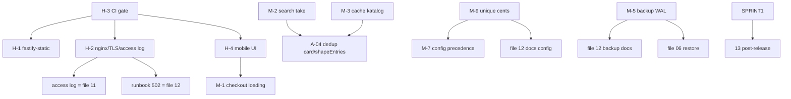

# Execution Plan — Production Readiness Remediation

Dihasilkan oleh `execution/00-release-manager.md`. Sumber issue: `audit/reports/phase-15-production-readiness.md`.
**Bukan patch** — playbook koordinasi eksekusi. Skala: satu toko, SQLite single-writer.

**Baseline regresi (gate semua PR):** `pnpm -r typecheck` bersih (8 workspace) · `npx vitest run` **518/518** (42 file) di `master`. Setiap PR wajib menjaga/menaikkan baseline ini.

---

## 1. Sprint Board

### Sprint 1 — Critical + High (rilis publik)
> Critical = **0**. Fokus: gate regresi + permukaan rilis publik.

| Issue | Ringkas | Owner-file | Effort |
|---|---|---|---|
| H-3 | CI (typecheck+vitest) tiap PR | `03-cicd` | S |
| H-1 | Upgrade `@fastify/static` ≥9.1.1 | `01-security-fix` | S |
| H-2 | nginx + TLS + access log + runbook 502 | `02-devops-fix` (+`11`) | M |
| H-4 | Audit visual mobile | `04-mobile-ui-fix` | M |

### Sprint 2 — Medium
| Issue | Ringkas | Owner-file | Effort |
|---|---|---|---|
| M-1 | Loading/disable checkout (anti double-submit) | `04-mobile-ui-fix` | S |
| M-2 | `searchCatalogEntries` `take` | `05-performance` | S |
| M-3 | Cache read katalog (bila benchmark perlu) | `05-performance` | M |
| M-9 | `USE_UNIQUE_CENTS=1` prod + verifikasi idempotensi | `08-payment` | S |
| M-7 | Presedensi config env-vs-DB (dok + patch bila perlu) | `07-config` | S |
| M-5 | Backup/restore SQLite WAL teruji | `06-database` (+`02`) | M |
| M-6 | Upload magic-bytes | `01-security-fix` | S |
| M-4 | Container drop-root (gosu) | `02-devops-fix` | S |
| M-8 | Verifikasi Dockerfile CMD vs compose | `02-devops-fix` | S |

### Sprint 3 — Low + Technical Debt
| Issue | Ringkas | Owner-file | Effort |
|---|---|---|---|
| A-04 | Satukan `card()` ↔ `shapeEntries` | `09-refactor` | S |
| A-02 | Pecah `handlers/checkout.ts` | `09-refactor` | M |
| A-01/03/05 | God-file lain (bertahap) | `09-refactor` | L |
| F-01..F-04, L-9 | Test gap (search/voucher/wallet/webhook/audit) | `10-testing` | M |
| L-8 | Redaksi log `bot.catch` | `11-observability` | S |
| L-7 | rateLimit housekeeping | `11-observability`/`09` | S |
| L-1/L-2/L-3/L-6 | Bersih file root, dark mode (keputusan), dok arsitektur | `12-documentation` | S |
| DOC-01..05 | Documentation roadmap | `12-documentation` | M |

---

## 2. Dependency Graph

**Aturan urutan (X sebelum Y, alasan):**
- **H-3 sebelum semua** — CI adalah gate regresi; tanpa CI tiap PR berikutnya tak terlindungi.
- **H-1 sebelum H-2** — pastikan dependency bersih sebelum mengekspos publik.
- **H-2 mencakup L-01** — mengaktifkan access log (file 11) bagian dari diagnosa 502; kerjakan bersama.
- **M-2/M-3 sebelum A-04** — keduanya menyentuh `packages/db/src/crud/catalog.ts` & `storefront/routes/catalog.ts`; refactor dedup setelahnya menghindari konflik & rework.
- **M-9 sebelum M-7/dok** — keputusan unique-cents memengaruhi tabel sumber-kebenaran config & dok pembayaran.
- **M-5 ↔ file 06 ↔ file 12** — strategi backup (DBA) & dokumentasinya sejalan.
- **Sprint 1 selesai sebelum file 13** — post-release checklist dijalankan saat rilis.

---

## 3. Urutan PR (rekomendasi)

| PR# | Issue | Owner-file | Blast radius | Test terdampak | Risiko | DoD |
|---|---|---|---|---|---|---|
| 1 | H-3 | 03 | `.github/workflows/` (baru) | — (menjalankan suite) | Rendah | CI hijau & required di `master` |
| 2 | H-1 | 01 | `apps/{storefront,web-admin}` static/uploads | storefront+web-admin test | Sedang (major v8→v9) | suite hijau; `/static`+`/uploads` 200+header |
| 3 | H-2 (+L-01) | 02,11 | ops nginx + `*/server.ts` logger | web tests | Sedang | TLS+cookie secure+access log; 502 runbook |
| 4 | H-4 | 04 | template njk (storefront+admin) | render tests | Rendah | checklist mobile lulus; desktop tak regресi |
| 5 | M-1 | 04 | form checkout/pay | storefront tests | Rendah | no double-submit; no-JS tetap jalan |
| 6 | M-2 | 05 | `crud/catalog.ts` | `product_groups.test.ts` | Rendah | output identik + `take` aktif |
| 7 | M-9 | 08 | env prod + verifikasi payments | crud payments tests | Rendah | no warn boot; idempotensi terverifikasi |
| 8 | M-7 | 07 | docs (+resolver bila perlu) | settings/setup tests | Rendah | tabel presedensi + konsisten |
| 9 | M-5 | 06,02 | ops backup/restore | — | Sedang | restore teruji + integrity_check |
| 10 | M-6 | 01 | `lib/upload.ts` | web-admin upload tests | Rendah | MIME palsu ditolak |
| 11 | M-4,M-8 | 02 | Dockerfile/compose | — | Rendah | non-root + semua surface up |
| 12+ | Sprint 3 | 09,10,11,12 | per-unit | per-unit | bervariasi | per file owner |

> Tiap PR: branch `fix/<id>-<slug>` → patch minimal → `pnpm -r typecheck && npx vitest run` hijau → review → merge.

---

## 4. Definition of Done per Sprint

**Sprint 1 (rilis publik):**
- H-1..H-4 merged; CI hijau & required check aktif.
- Smoke test (`13`) lulus untuk web-admin, storefront, bot.
- TLS aktif, `WEB_COOKIE_SECURE=true`, access log mengalir, runbook 502 ada.
- `pnpm -r typecheck` + `npx vitest run` ≥518 hijau.

**Sprint 2:**
- M-1..M-9 merged; benchmark (`05`) tak menurun; payment integrity checklist (`08`) lulus.
- Backup WAL teruji restore (`06`); presedensi config terdokumentasi (`07`).

**Sprint 3:**
- Low + technical debt; tiap refactor "perilaku identik" (test jaring hijau); coverage tak turun; test gap (`10`) tertutup.

---

## 5. Exit Criteria — Rilis Publik (dari phase-15 DoD)
1. H-1 `@fastify/static` ≥9.1.1 (test hijau).
2. H-2 nginx + TLS + `WEB_COOKIE_SECURE=true` + access log + checklist 502.
3. H-3 CI (typecheck + vitest) jalan di PR.
4. H-4 audit visual mobile selesai (halaman utama).
5. M-5 backup WAL aman + restore teruji.
6. M-9 `USE_UNIQUE_CENTS=1` di prod.

> **Go privat** setelah PR#1 (H-3) & PR#2 (H-1). **Go publik** setelah seluruh Exit Criteria hijau.
